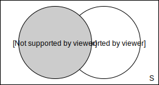
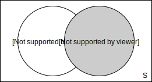

# Joins

**Joins** erlauben es einem mehrere Tabellen bei einer `select`-Anweisung miteinander zu verbinden. Ohne *Joins* ist das verbinden von mehreren Tabellen nicht einfach möglich, man kann zwar bei in der `FROM`-Klausel einer `select`-Anweisung mehrere Tabellen angeben, aber kriegt dann das Kreuzprodukt der beiden Tabellen (außer man spezifiziert mithilfe der `WHERE`-Klausel etwas ähnliches wie das was ein *join* bewirken würde, das nennt man dann *impliziter Join*). Joins sind dazu da die Verbindung zu konkretisieren und zu spezifizieren welche Datensätze zusammen gehören, sodass man das kriegt was man braucht und nicht jegliche Mögliche Kombination (auch das kann seinen Nutzen haben).

> **Kreuzprodukt** (oder auch *kartesisches Produkt*) bedeutet, dass jeder Datensatz aus Tabelle *A* mit jedem Datensatz aus Tabelle *B* verbunden wird, somit hat man also `count(A) * count(B)` Datensätze

Es gibt verschiedene Arten von *joins* mit verschiedenen Nutzen und Ergebnissen.

## Impliziter Join

Ein *impliziter Join* ist eine Art Join, welcher durch die `WHERE`-Klausel implementiert wurde. Er ähnelt in seiner einfachsten Form dem *Inner Join*, man kann aber auch andere *Join-Typen* abbilden. Würde man nicht die `WHERE`-Klausel haben hätte man das Kreuzprodukt der Tabellen `TableA` und `TableB`.

```sql
SELECT id, ... FROM TableA A, TableB B
  WHERE A.id = B.id
```

## Inner Join

Beim *Inner Join* werden nur die Datensäzte genommen, die die `JOIN`-Condition unterstützen, also die Datensäzte, die in beiden Tabellen existieren, nicht nur in einem.

```sql
SELECT id, ... FROM TableA A
  INNER JOIN TableB B
  ON A.id = B.id
```


## Outer Join

Der *Outer Join* gibt einfach die Datensätze beider Tabellen zurück und falls für 2 Datensätze die `JOIN`-Condition wahr ist, werden die beiden Datensätze der beiden Tabellen zusammengelegt.

```sql
SELECT id, ... FROM TableA A
  FULL OUTER JOIN TableB B
  ON A.id = B.id
```


## Left & Right Join

*Left Join* und *Right Join* sind fundamental das gleiche, mit dem einen Unterschied, dass der *Right Join* sozusagen eine gespiegelte Version des *Left Joins* ist. Daher wird jetzt nur der *Left Join* erläutert und die passenden Tabellennamen für den *Right Join* werden in Klammern dazu geschrieben.

Beim *Left Join* werden alle Ergebnisse aus Tabelle **A** (B) genommen und falls es passende Daten aus Tabelle **B** (A) zur jeweiligen Spalte gibt, werden diese zur jeweiligen Spalte hinzugefügt.

```sql
SELECT id, ... FROM TableA A
  LEFT JOIN TableB B
  ON A.id = B.id
```




Man kann zusätzlich (wie bei allen *Joins*) auch eine `WHERE`-Condition angeben. Hiermit kann man die Datensätze dann noch weiter filtern.

Man kann alle Datensätze von **B** (A) aussortieren, sodass nurnoch Datensätze von **A** (B) vorhanden sind für die die **B** (A) **keine** Datensätze hat indem man `WHERE B.id = NULL` (`A`) hinzufügt. Da in **B** (A) kein passender Datensatz vorhanden ist. hat man `NULL` als `id`, somit werden mit `B.id = NULL` (`A`) alle aussortiert, die Daten haben. 

## Natural Join
Ein Natural Join verbindet zwei Tabellen wie auch die anderen Joins, allerdings muss man nicht wie bei den anderen Joins ein Attributpaar angeben sondern der Natural Join verbindet automatisch den Primarykey der einen mit dem Foreignkey der anderen Tabelle. Der Natural Join verhält sich wie ein *Inner Join*, es ist aber möglich durch das hinzufügen von `LEFT`, `RIGHT`, `OUTER`, ... das Verhalten aller Joins zu erreichen, somit bleibt eigentlich nurnoch, dass `NATURAL` ein Prefix für normale Joins ist, wodurch die `ON`-Klausel nicht benötigt wird. 

```sql
SELECT id, ... FROM TableA A
  NATURAL JOIN TableB B
```