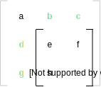
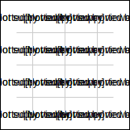

# Matrix inverse

Es gibt mehrere Methoden um eine *inverse Matrix* für eine Matrix zu berechnen. Inverse bei Matrizen haben ähnliche Bedingungen wie bei “normalen” Zahlen. $M \cdot M^{-1}  = E$, wobei $E$ das neutrale Element ist. Das neutrale Element für Matrizen hängt von der Größte der Matrizen ab, es existiert nur für quadratische Matrizen.

Mit diesem Wissen und der Möglichkeit 2 Matrizen zu multiplizieren kann man sich theoretisch die inverse Matrix durch aufstellen von Gleichungen (solve, ...) erlangen, dass ist aber eine der schlechteren Methoden zur Bildung von Inversen. 

## Gauss-Jordan-Algorithmus

Eine Methode ist es einen Art Gauss-Algorithmus auf die Matrix anzuwenden und diese so umzuformen, dass man beim neutralen Element landet. Währenddesssen führt man die exakt gleichen Schritte die man auf der Matrix ausführt auch auf dem neutralen Element aus. Sobald man fertig ist, sollte man die Matrix $M$ zum neutralen Element $E$ und das neutrale Element zur Matrix $M^{-1}$ verändert haben. Diese Methode wird Gauss-Jordan Methode genannt.

Dieser Prozess ist nicht unbedingt der beste, da man keinen optimalen Weg gegeben hat, sondern selber rum probieren muss. Zudem kann man sehr sehr leicht kleine Fehler machen, welche dann hinterher ein ganz anderes Ergebnis liefern. Daher ist diese Methode vorallem für Klausuren oder andere relativ stressige Umgebungen eher nicht geeignet. 

Es gibt eine besser Methode die einem **immer** das Inverse liefert ohne das man selber komisch rum probieren muss.

## Analytic Solution / Cramersche Regel

Diese Methode ist nicht unbedingt (mathematisch / algorithmischen) effizient bei sehr großen Matrizen, der Vorteil dieser Methode ist aber der algorithmischen und rekursive Vorgang, welcher es erlaubt **ohne** raten vorzugehen. Daher ist dieser Algorithmus für seinen Nutzen hier schon effizient. 

Dieser Algorithmus wird auch “Analytic Solution” oder “Cramersche Regel” genannt. Die “Cramersche Regel” ist eigentlich, genau wie der Gauss-Algorithmus ein Weg lineare Gleichungssysteme zu lösen. Hierbei ist die Berechnung eines Inversen nur eine bestimmte Anwendungsaufgabe. 

### Vorgehensweise

Gegeben sei eine Matrix $M$ mit Größe $n \times n$

Es gibt 4 Schritte die man nacheinander abarbeiten muss um das Inverse $M^{-1}$ der Matrix $M$ zu erhalten:

- Die sogenannte *“Matrix of Minors”* von $M$ berechnen
- Daraus die *“Matrix of Cofactors”* berechnen
- Danach die Adjunkte berechnen, indem man die *“Matrix of Cofactors”* transponiert
- Die entstandene Matrix $adj(M)$ zuletzt mit $\dfrac{1}{\text{Determinante(M)}}$ multiplizieren

Man sollte eine Gleichung dieser Form am Ende erhalten:

$$M^{-1} = \dfrac{1}{det(M)} \cdot adj(M)$$

Nun muss man noch klären wie die “Matrix of Minors”, “Matrix of Cofactors” und die Determinante berechnet werden. 

#### Minor

Um die *Determinante* und die *Matrix of Minors* berechnen zu können braucht man Minors. Die Idee hinter Minors ist, dass man aus einer Matrix $M$ alle Elemente nimmt, die **nicht** auf der gleichen Zeile oder in der gleichen Spalte von $a_{ij}$ sind und aus ihnen eine neue Matrix erstellt, welche dann die Größe $n-1 \times n-1$ hat.

> Minor wird auch Unterdeterminante genannt

Die Notation für die Berechnung eines Minors einer Matrix ist $mnr(a_{ij})$.



#### Determinante

Die Berechnung der Determinante für eine Matrix $M$ ist eine rekursive Definition. Sobald man an dem Punkt angekommen ist, bei dem man  die Determinante einer $1 \times 1$ Matrix berechnen müsste wird $a_{11}$ stattdessen genommen. Dies ist damit die Abbruchbedingung.

> Anstatt $det(M)$ schreibt man auch oft $|M|$.

Die Determinante ist definiert als:

$$det(M) = \sum\limits_{j=1}^{n_M}  (-1)^{1+j} \cdot M_{1j} \cdot det(mnr(a_{1j})) \quad |\\ n_M > 1\\\\
det(M) = M_{11} \quad |\\ n_M = 1$$

Wie man sieht wird die Determinante berechnet indem man die erste Zeile der Matrix durchläuft, jeden Wert ($a_{1j}$) mit der Determinante der Minor des Wertes in der Matrix $M$ multipliziert. Die entstandenen Werte werden danach aufsummiert, wobei jedes zweite mal das Vorzeichen vor dem entstandenen Wert gewechselt wird. Dies kann man mit $(-1)^{1+j}$ erreichen. Die $1$ im Exponenten steht für $i$, welches auf $1$ festgesetzt ist, dadurch, dass nur die erste Zeile durchlaufen wird.

Mit diesem Beispielbild kann man gut erkennen wie man vorgehen muss


#### Matrix of Minors

Die *Matrix of Minors* ist in ihrer Definition sehr ähnlich wie die Determinante, der große Unterschied ist, dass man nicht nur für die erste Zeile Werte berechnet, sondern für jedes Element aus der Matrix. Zudem summiert man nicht die entstandenen Werte mit wechselndem Vorzeichen auf, sondern erstellt aus ihnen einfach eine neue Matrix. Man erhält also eine Matrix gleicher Größe.

Die Matrix of Minors ist definiert als:

$$M(A) = M \quad |\\ M_{ij} = det(mnr(A_{ij}));\ M \in \R^{n_A \times n_A}$$

> Es gibt nicht unbedingt ein gutes Zeichen, bzw. guten "Funktionsnamen" für die Matrix of Minors, also wurde hier einfach $M$ verwendet und auf eine Matrix $A$ angewandt. Der Buchstabe $M$ wird häufig auch für Matrizen benutzt und bedeutet deshalb nicht unbedingt das es sich um eine Matrix of Minors handelt

#### Matrix of Cofactors

Die *Matrix of Cofactors* fügt den Vorzeichenwechsel zur *Matrix of Minors* hinzu den es auch bei der Determinante schon gab.  Die *Matrix of Cofactors* ist somit die einfachste Rechnung im gesamten Algorithmus, man muss nur jeden 2. Wert mit $-1$ mal nehmen bzw. das Vorzeichen wechseln. Mit diesem Beispielbild sollte jedem klar sein wie dies funktioniert



Mathematisch kann man dies erreichen, indem man $(-1)^{i+j}$ mit jedem Element multipliziert.

Falls man einen Algorithmus programmieren will kann man auch dies nutzen, anstatt zu exponenzieren

```js
(i + j) % 2 === 0 ? M[i][j] : -M[i][j]
```


#### Adjunkte

Die Adjunkte ist eine Matrix, welche man erhält indem man die vorher erklärten Definitionen anwendet. Man berechnet die Matrix of Minors für $M$, danach ändert man mit der Matrix of Cofactors die Vorzeichen. Zu guter letzt muss man die daraus entstandene Matrix von transponieren.

$$adj(M) := (\text{Cofactors}(\text{Minors}(M)))^T$$

Damit kann man dann zuletzt alle Oben genannten Schritte anwenden und mit $\dfrac{1}{det(M)} \cdot adj(M)$ das Inverse zu $M$ bilden.


## 2x2 Inverse

Da die Inverse einer $2 \times 2$ Matrix oft vorkommt und man vermutlich lieber einfach die Formel so haben will anstatt den ganzen Algorithmus anzuwenden um auf die Inverse anzuwenden kann ist hier die Formel

$$\begin{pmatrix}a & b\\\\c & d\end{pmatrix}^{-1} = \dfrac{1}{ad - bc} \cdot \begin{pmatrix}d & -b\\\\-c & a \end{pmatrix}$$

Mit dem Algorithmus lässt sich dies schnell herleiten, also hier die Kurzfassung:

- Durch die *Matrix of Minors* tauschen zunächst $a$ und $d$, sowie $b$ und $c$ die Position
- Durch die *Matrix of Cofactors* werden die Vorzeichen vor $ b$ und $c$ vertauscht
- Durch das *Transponieren* werden $-b$ und $-c$ wieder zurück getauscht
- Die *Determinante* ist $ad - bc$, da die Minors von $a$ und $b$ jeweils $d$ und $c$ sind

<br />
<br />

**Nützliche Links**

> [eigene Code implementation](mathe/matrix_inverse_code)
>
> [MathIsFun/MatrixInverse](https://www.mathsisfun.com/algebra/matrix-inverse-minors-cofactors-adjugate.html)<br />
> [MathIsFun/Determinant](https://www.mathsisfun.com/algebra/matrix-determinant.html)<br />
> [Cliffsnotes/LaplaceExpansion](https://www.cliffsnotes.com/study-guides/algebra/linear-algebra/the-determinant/laplace-expansions-for-the-determinant)