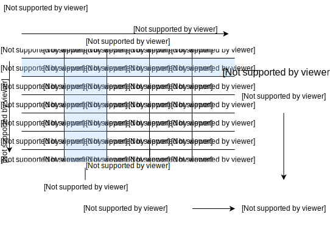
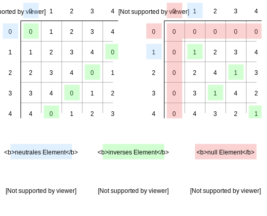

# Modulo, Module und Restklassen

##  Modulo

Will man in der Menge der natürlichen Zahlen eine Zahl **a** durch eine Zahl **m** teilen so erhält man einen Rest **r**. Für diesen Rest gilt $0 \le r \le m-1$. Die Modulo-Funktion liefert zu gegebenen Zahlen **a** und **m** gerade diesen Rest **r**. Man schreibt auch:
$a \text{ mod } m = r$
$19 : 4=4 \text{ Rest } 3$ also gilt $19 \text{ mod } 4 = 3$

Für **negative** Zahlen bestimmt man den Positiven Rest indem man ein hinreichend großes Vielfaches von m addiert:
$-47 \text{ mod }5=(-47+50)\text{ mod }5=3$

## Modul, Restklasse

Die Restklasse ist immer eine Menge von Zahlen, wobei diese Zahlen immer im gleichen Modul den gleichen Rest ergeben. Das bedeutet, dass z.B. im Modul $\Z_5$ die Restklasse $1 = \{..., -4, 1, 6, 11, ... \}$ ist, auch als $\overline{1}$ dargestellt. Wie man sieht sind auch negative Zahlen in einer Restklasse vorhanden. Da die Auflistung als Menge aufwendig ist und man "..." nutzen muss wird oft auch $\overline{r}$ genutzt.

Das Modul $\Z_m$ sind die Reste, die beim Teilen durch m auftreten können. z.B. $\Z_5=\{0;1;2;3;4\}$. Dabei hat jede ganze Zahl ihren Vertreter, die Restklasse. So ist z.B. die Restklasse der **3** im Modul **5** gleich $\overline{3}=\{...;-7;-2;3;8;13;18;23;...\}$

Im Modul $\Z_m$ kann man auf die übliche Art rechnen. Das Ergebnis wird aber wieder in den $\Z_m$ abgebildet.
Die modulo-Funktion ist strukturerhaltend sie ist ein Homomorphismus

**Beispiel**:
$678 + 471 \text{ mod } 5 = 3+1 \text{ mod } 5 = 4$

### Regeln in den Modulen

