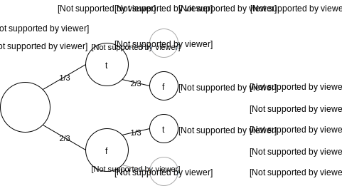

# Pfadregeln

Pfadregeln beschreiben, wie man Wahrscheinlichkeiten in einem Baumdiagramm berechnet. Es gibt 2 fundamentale Pfadregeln, die Pfadmultiplikationsregel und die Pfadadditionsregel.

## Pfadmultiplikationsregel

Bei der Pfadmultiplikationsregel will man die Wahrscheinlichkeit bis zu einem bestimmten Punkt im Baumdiagramm, meistens ein Ereignis (also am Ende des Baumdiagammes) berechnen. Hierzu geht man die Pfade ab, bis man am Zielpunkt angekommen ist und multipliziert alle Wahrscheinlichkeiten, inklusive der Wahrscheinlichkeit des Zielpunktes auf. Der resultierende Wert ist die absolute Wahrscheinlichkeit, das dieses Ereignis eintritt.

## Pfadadditionsregel

Bei der Pfadadditionsregel will man die Wahrscheinlichkeit mehrerer Pfade zusammenrechnen, da diese logisch in Verbindung stehen. Da man vorher mit der Pfadmultiplikationsregel die absoluten Wahrscheinlichkeiten dieser Ereignisse berechnet hat kann man diese nun einfach aufaddieren und erhält die absolute Wahrscheinlichkeit, dass eins der Ereignisse eintritt.

