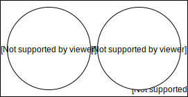
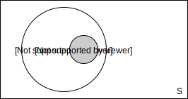
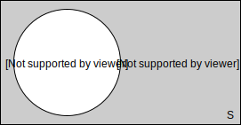
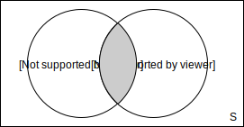
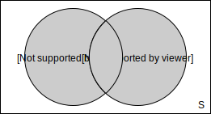
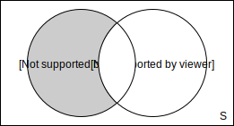
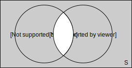
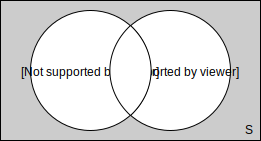
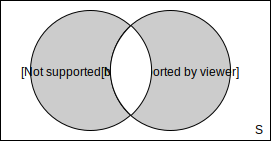

# Verknüpfung von Ereignissen

Ereignisse sind Mengen bzw. Teilmengen der Ergebnismenge $S$. Durch Verknüpfung von Ereignissen kann man neue Ereignisse bilden. Für zwei Ereignisse $A$ und $B$ gilt: 

| Mengenbild                                                 | Symbol                | Beschreibung                      | Wahrscheinlichkeit berechnen    |
| ---------------------------------------------------------- | --------------------- | --------------------------------- | --------------------------------|
|            | $A \cap B=\text{\O}$  | $A$ und $B$ sind disjunkt         | -                               |
|          | $B \subset A$         | $B$ ist ein Teilereignis von $A$  | -                               |
|  | $\overline{A}$        | Das Gegenereignis von A           | $1-P(A)$                        |
|                      | $A \cap B$            | $A$ und $B$ treffen ein           | $P(A) \cdot P(B)$               |
|                    | $A \cup B$            | $A$ oder $B$ treffen ein          | $(P(A) + P(B))-P(A) \cdot P(B)$ |
|                    | $A \diagdown B$       | $A$ ohne $B$                      | $P(A)-(P(A) \cdot P(B))$        |
|      | $\overline{A} \cup \overline{B}$   | trifft immer ein, wenn $A$ und $B$ nicht gleichzeitig eintreffen | $1-(P(A) \cdot P(B))$                    |
|                  | $\overline{A} \cap \overline{B}$   | trifft ein wenn weder $A$ noch $B$ eintreffen                    | $1-((P(A) + P(B))-P(A) \cdot P(B))$      |
|            | $(A \cap \overline{B}) \cup (\overline{A} \cap B)$ | trifft ein wenn genau eines der Ereignisse $A$ und $B$ eintrifft | $(P(A) + P(B))- 2 \cdot P(A) \cdot P(B)$ |

## De Morganschen Gesetze

Die Aussagen der Verknüpfungstabelle werden durch die *De Morganschen Gesetze* bestätigt, welche lauten:

$$\overline{A \cap B} = \overline{A} \cup \overline{B}$$

$$\overline{A \cup B} = \overline{A} \cap \overline{B}$$

**Beispiel**:

Weder $A$ noch $B$ $:=\overline{A} \cap \overline{B}$ ist das Gegenereignis von $A$ oder $B$ $:= A \cup B$