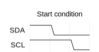
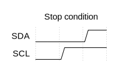

# I2C

I2C (Inter-Integrated Circuit) ist ein Interface Protokoll welches für die Verbindung von „low speed“-Geräten wie z.B. Microcontroller und oder Sensoren. In *Embedded Systems* findet der I2C-Bus seinen häufigsten Nutzen. Erfunden wurde I2C von Philips, wird nun aber von so gut wie allen IC Herstellern verwendet, eventuell unter dem Namen „**TWI**“ (**T**wo **W**ire **I**nterface) um Lizenzproblemen aus dem Weg zu gehen.

## Vorteile

Die Vorteile von I2C sind, dass es von nahezu jedem verwendet werden kann, es gibt kein unteres Limit für die Geschwindigkeit, womit selbst simpelste Geräte I2C nutzen können, zwar langsam, aber oft reicht eine sehr geringe Datenübertragungsrate weitaus aus. Man kann selbst Microcontroller nutzen, die keine direkte Hardwareunterstützung für I2C haben, da man mit den I/O Pins selber die Kommunikation implementieren kann. Es werden des weiteren nur 2 Kabel mit Pull-Up Widerständen gebraucht. I2C basiert wie viele andere Protokolle (z.B. USB) auf einem Master-Slave System, wobei es aber bei I2C mehrere Master geben kann ungleich wie bei vielen anderen solchen Systemen.

Die Maximale Datenübertragungsrate wurde mit der Zeit immer weiter erhöht.

| Name                 | Geschwindigkeit |
| -------------------- | --------------- |
| Low-speed Mode       | 10 kbit/s       |
| Standard Mode        | 100 kbit/s      |
| Fast Mode            | 400 kbit/s      |
| Fast Mode plus / Fm+ | 1 Mbit/s        |
| High Speed Mode      | 3.4 Mbit/s      |
| Ultra Fast Mode      | 5 Mbit/s        |

## Kabel

Die beiden Kabel die I2C nutzt werden **SDA** für **Serial Data** und **SCL** für **Serial Clock** genannt. Der Master gibt immer den Clock an, also die Taktrate mit der die Kommunikation stattfindet. Damit jeder mit der Taktrate klar kommt guckt der Master am Anfang zunächst, was die höchste Taktrate ist, mit der *alle* angeschlossenen Geräte klarkommen. Die beiden Verbindungen sind „Open Drain“ und müssen daher zunächst mit einem Pull-up Widerstand auf VCC gebracht werden. 


Die maximale Kabellänge hängt von der Busgeschwindigkeit, aber auch viel von der Art der Kabel und der Umgebung ab. Somit ist eine eindeutige und allgemein-gültige Angabe über die Länge schwer, meistens sollte aber eine Länge von **30cm - 1m** relativ einfach funktionieren. Es gibt auch Wege I2C über CAT5 Kabel zu nutzen, womit eine Länge von ungefähr 100m erreicht werden kann. Man sollte generell darauf achten, dass man möglichst kurze Strecken nutzt, die Kabel nicht direkt neben Stromkabel entlang legt und wenn man höhere Längen braucht sollte man unbedingt geshieldete Kabel haben. 

## Adressen

Jedes Slave-Device hat eine eindeutige und einzigartige **7-Bit** Adresse zugewiesen, worüber es erreichbar ist, somit kann man genau ein Gerät adressieren und muss kann eigene Wege der adressierung implementieren über die Daten die man sendet (was oft nicht möglich wäre, da man z.B. Sensoren schlecht neu programmieren kann um dies dann zu unterstützen). Einige Geräte haben festgesetzte Adressen, bei anderen lässt sich die Adresse teilweise konfigurieren durch beispielsweise Dip switches oder ähnliches. Der Master braucht keine Adresse, da er von keinem direkt angesprochen werden kann, ohne das er die Konversation initiiert. 

Der Transfer zwischen Master und Slave ist in Packets von jeweils 8 Bit gruppiert. Die Adresse macht somit zunächst erstmal 7 der 8 Bit aus, das letzte Bit ist ein Bit namens `R/W'` (Read / Write), welches Informationen über die Richtung des Datenstromes gibt. Wenn das Bit `0` ist, dann schickt der Master Daten an den Slave, wenn das Bit `1` ist, dann schickt der Slave Daten an den Master. Die Bezeichnung kann man also aus Sicht des Slaves sehen, wenn `R` dann muss der Slave lesen, wenn `W`, dann muss der Slave schreiben.


> Es gibt auch noch laut Spezifikation eine 10-Bit Adressierung, welche dann über mehrere Packets spannt, diese wird aber selten benutzt.

Einige Adressen sind von der Spezifikation aus reserviert.

| 7-Bit Adresse und R/W' | Beschreibung                          |
| --------------------- | ------------------------------------- |
| `0000 000 0`          | General Call (ähnelt einem Broadcast) |
| `0000 001 x`          | CBUS Address                          |
| `0000 010 x`          | Reserviert für ein anderes Bus Format |
| `0000 011 x`          | Reserviert für Zukünftiges            |
| `0000 1xx x`          | HS-mode master code                   |
| `1111 1xx 1`          | Device ID                             |
| `1111 0xx x`          | 10-bit slave Adressierung             |

Beispielcode für Adressierung unter Benutzung einer Write Funktion:

```c
void i2c_address(unsigned char address, unsigned char read_write) {
  i2c_write((address << 1) + read_write);
}
```

## Protokoll

Standardmäßig sind *SCL* und *SDA* auf high. Der Master beginnt die Kommunikation mit der sogenannten *Start condition* (`S`) gefolgt von der Adresse des Slaves und dem `R/W‘`-Bit. Sobald der Datenstrom vollendet ist schickt der Master die *Stop condition* (`P`). 

### Clock

Der Master gibt immer den Clock an, niemals der Slave. Der Clock setzt die Geschwindigkeit fest mit der Daten übertragen werden können. Der Slave kann den Master ausbremsen um dem Master mitzuteilen, dass der Clock zu schnell für ihn ist. Dies erfolgt indem der Slave *SCL* auf low zieht und hält bis er bereit ist weitere Daten zu empfangen während der Master in der low Phase seines Taktes ist (*Clock Stretching*, manchmal auch *Clock Synchronization* genannt). Dies kann aber jeweils nur nach einem kompletten gesendeten Byte passieren, während der kompletten anderen Zeit darf nur der Master die *SCL*-Leitung verändern. 

### Start und Stopp

Die *Start condition* und *Stop condition* sind zwei besondere Sequenzen. Sie sind die einzigen beiden Sequenzen, bei denen SDA sich verändern darf, während SCL auf High ist. Bei der Datenübertragung muss SDA unbedingt gleich bleiben während SCL auf High ist. Die *Start-* und *Stop-condition* markieren den Anfang und das Ende der Kommunikation mit einem Slave. Es gibt eine sogenannte *Repeated Start condition*, hierbei wird eine weitere *Start condition* mit derselben Adresse, aber meist anderem `R/W'`-Bit geschickt. Dies kann passieren, ohne dass durch ein *Stop* die Verbindung beendet wurde und dient eigentlich nur dazu zwischen Lesen und Schreiben zu wechseln. 




Beispielcode für Start:

```c
void i2c_start() {

  SDA = 1; // Auf Nummer sicher gehen, dass
  SCL = 1; // beide wirklich zunächst auf
  delay(); // High sind (relevant für repeated start)

  SDA = 0;
  delay();
  SCL = 0;

}
```

Beispielcode für Stop:

```c
void i2c_stop() {
  SDA = 0; // Wiedermal auf Nummer
  SCL = 0; // sicher gehen, dass beide
  delay(); // zunächst auf Low sind

  SCL = 1;
  delay();
  SDA = 1;
}
```

### Datenübertragung

Die Datenübertragung kann erfolgen, sobald eine *Start condition* oder *Repeated Start condition* geschickt wurde, gefolgt von der Adressierung des Slaves und einstellung des `R/W'`-Modus. Die Datenbits werden im Takt mit der *SCL*-Leitung geschickt.

Beispielcode für Read:

```c
unsigned char i2c_read() {
  char byte = 0;
  char i;
  for(i = 0; i < 8; i++) {
    SCL = 0;
    delay();
    SCL = 1;
    delay();
    byte += SDA << (7-i);
    delay();
  }
  return byte;
}
```

Beispielcode für Write (inklusive Einlesen des ACK/NACK):

```c
void i2c_write(unsigned char byte) {
  delay();

  char i;
  for(i = 0; i < 8; i++) {
    SDA = byte >> (7 - i) & 0x01;
    delay();
    SCL = 1;
    delay();
    SCL = 0;
		delay();
  }

  SCL = 1;
  delay();

  if(SDA == 0) {
     // acknowledge
  } else {
     // not acknowledge
  }
}
```

### Acknowledge

Nach jedem Übertragenen Byte muss der jeweils andere ein `ACK`  (Acknowledge) bzw. ein `NACK` (Not Acknowledge) schicken um zu bestätigen, dass die Daten korrekt bzw. nicht korrekt eingetroffen sind bzw. ob sie korrekt / konsistent sind oder nicht. Wenn kein Acknowledge mehr kommt heißt das entweder, dass keine Daten mehr geschickt werden müssen, oder dass das Gerät noch nicht bereit ist für mehr. Danach muss der Master entweder die *Stop condition*, oder eine *Repeated Start condition* senden. Falls ein `NACK` gesendet wird, muss selber die Fehlerkorrektur durchgeführt werden, es gibt keine standardmäßig implementierte Fehlerkorrektur. Wie dies genau erfolgt ist einem selbst überlassen.

Beispielcode für Acknowledge:

```c
void i2c_ack() {
  SCL = 0;
  delay();
  SDA = 0;
  delay();
  SCL = 1;
}
```

Beispielcode für Not Acknowledge:

```c
void i2c_nack() {
  SCL = 0;
  delay();
  SDA = 1;
  delay();
  SCL = 1;
}
```

### Multi-Master

I2C kann mit mehreren Master gleichzeitig benutzt werden, hierbei ist es wichtig für die einzelnen Master zu erkennen, ob die Leitung gerade frei ist oder nicht. Entweder hat der Master die ganze Zeit lang schon aufgepasst, ob ein *Start* geschickt wurde, ode muss andernfalls für eine gewisse Zeit gucken, ob SCL und SDA auf Low gezogen werden oder nicht. Wenn ja, dann werden diese gerade verwendet, wenn nicht, dann sollten sie frei sein. Falls die Leitung nicht frei ist, muss der Master auf die *Stop condition* warten.