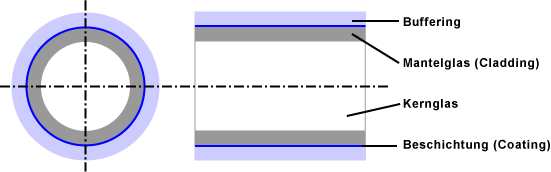

# Lichtwellenleiter

**Lichtwellenleiter** bestehen aus Kunststofffasern oder ggf. auch Glasfasern. Durch diese Fasern werden mithilfe von LEDs oder Lasern Lichtwellen gesendet. Die Reichweite und Bandbreite von Lichtwellenleitern sind Kupferbasierten Übertragungsmedien klar überlegen.

Lichtwellenleiter kommen mit vielen Vorteilen:
- hohe Datenübertragungsrate
- geringe Dämpfung
- hohe Reichweite
- kein Crosstalk
- Galvanische Trennung

Aber auch einigen Nachteilen:
- mechanisch sehr empfindlich
- hoher Preis
- hoher Installationsaufwand
- kein Power over Ethernet (PoE)

## Aufbau

Der *Faserkern* (Kernglas) ist der zentrale Bereich eines Lichtwellenleiters, der zur Führung der Lichtwellen dient. Der Kern besteht aus einem Material mit *hohem Brechungsindex*. Um den Kern befindet sich das *Cladding* (Mantelglas), dies besteht aus einem *dielektrischem Material* mit einem *niedrigeren Brechungsindex* als der Kern. Zwischen dem Kern und dem Cladding finden die nahezu verlustfreien Reflexionen des Lichtes bzw. der Lichtstrahlen statt. Außen auf dem Mantelglas befindet sich eine dünne Kunststoffschutzschicht, genannt *Coating*. Um das Coating befindet sich eine weitere Schutzschicht, das *Buffering*, es ist dafür da den Leiter vor Umwelteinflüssen zu beschützen.

## Arten

Es gibt verschiedene Arten von Lichtwellenleitern, welche sich in Technologie und damit auch Bandbreite und maximaler Länge unterscheiden.

### Multimode mit Stufenindexprofil

Durch die Faser bewegen sich mehrere Lichtwellen gleichzeitig, was in einer hohen Bandbreite resultiert. An den Wänden der Faser wird das Licht hart reflektiert. Über größere Distanzen können schnell Laufzeitunterschiede zwischen den Lichtwellen auftreten, wodurch die Faser nur über kürzere Distanzen gut geeignet ist.

### Multimode mit Gradientenindexprofil

Durch die Faser bewegen sich ebenfalls mehrere Lichtwellen gleichzeitig, was in einer hohen Bandbreite resultiert. An den Wänden der Faser wird das Licht weich reflektiert. Diese Faser ist somit gut geignet für Distanzen bis zu mittlerer Länge.

### Monomode

Monomodefasern haben einen sehr dünnen Kern und erlauben somit nur eine Lichtwelle. Diese Faser unterstützt große Distanzen, da man nicht die Gefahr hat, dass die Reihenfolge der Lichtwellen über  große Distanzen verändert wird, da es nur eine gibt. 

## Bandbreitenlängenprodukt

Wie es der Name schon andeutet, ist das *Bandbreitenlängenprodukt* das Produkt aus der Bandbreite (Frequenz) und der maximalen Länge des Lichtwellenleiters. Das Bandbreitenlängenprodukt dient zum einfacheren Vergleich von Lichtwellenleitern. Hierbei gilt, dass größer besser ist.

$\text{BLP} = B \cdot L$
