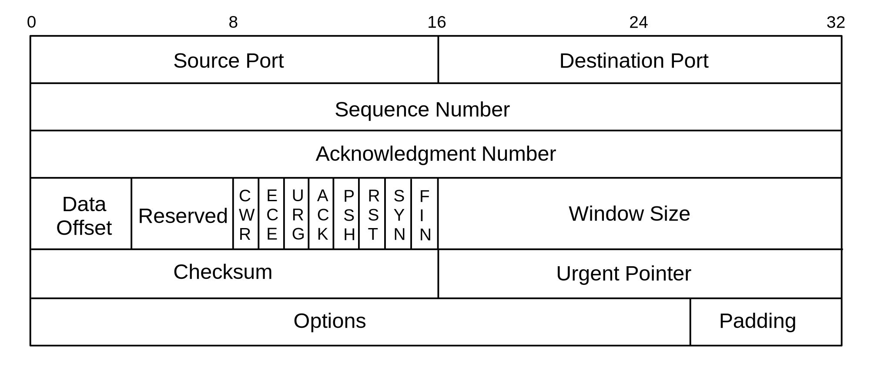
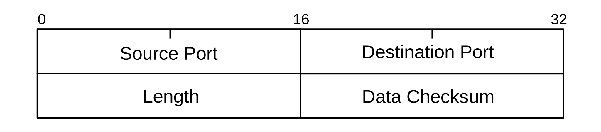

# OSI Schichtenmodell

Das OSI Schichtenmodell (Open Systems Interconnection Model) ist ein konzeptionelles Modell der Kommunikation zwischen Systemen. Das OSI Schichtenmodell soll Kommunikation über unterschiedlichste technische Systeme erlauben und definiert dazu 7 aufeinander aufbauende Schichten (/layers), welche jeweils nur eng begrenzte Aufgaben haben. Es gibt auch noch ein weiteres Modell, das TCP/IP Modell, welches nur aus 4 Schichten besteht. Diese Schichten sind vergleichbar mit einer oder mehreren Schichten des OSI Schichtenmodell. 

Die 7 Schichten sind:
- Application layer
- Presentation layer
- Session layer
- Transport layer
- Network layer
- Data-link layer
- Physical layer

Da die Schichten von unten-nach-oben aufeinander aufbauen sollte man auch mit den untersten Schichten anfangen. 

## Physical layer

Das *physical layer* ist die unterste Schicht des OSI-Schichtenmodells. Sie ist dafür da, mit verschiedenster Hardware eine standartisierte Bitübertragung zu gewährleisten. Das phsyical layer stellt den darüberliegenden Schichten eine Schnittstelle für das verschicken von Bits zur verfügung, egal ob die darunterliegende Hardware [Twisted Pair Kabel](/netzwerke/twisted_pair), [Lichtwellenleiter](/netzwerke/lwl), [WLAN](/netzwerke/wlan) oder noch etwas anderes ist. Abhöngig vom Medium gibt es nicht nur *nullen* und *einsen* die geschickt werden, sondern viele andere Werte, da z.B. Wellenlängen zur Übertragung von Informationen dienen, welche mehrer Werte annehmen können. Es ist die Aufgabe des physical layers mit diesen Unterschieden intelligent und effizient umzugehen um die beste, schnellste und verlustfreiste Lösung für die Übertragung von Informationen, zu gewährleisten, sodass die darüberliegenden Schichten Mediumunabhängig arbeiten können. 

## Data-link layer

Das *data-link layer* besteht zunächst aus zwei Teilen bzw. *sub-layers*: *MAC* und *LLC*. Diese werden gerne als 2a bzw. 2b betitelt. 

### MAC - Media Access Control

Jede Netzwerkkarte hat eine eindeutige MAC Adresse, diese ist 6 Byte (also 48 Bit) lang und lässt sich in 2 Teile unterteilen; die ersten 3 Bytes sind ein *Identifier* für den Hersteller, genannt *OUI* (Organizationally Unique Identifier), wobei ein Hersteller nicht nur einen Identifier zugewiesen hat sondern viele. Die restlichen 3 Bytes identifizieren die Netzwerkkarte einzigartig. MAC Adressen sind meistens nicht änderbar, da sie im read-only memory von Netzwerkkarten liegen.

MAC Adressen sind die Adressen, die für Kommunikation auf Layer 2 benutzt werden. Die Kommunikation im Layer 2 verläuft über die Dateneinheit *Frames*. Frames bestehen aus mehreren Datenfelder, unteranderem Quell und Ziel MAC Adresse und natürlich die eigentlichen Daten, die verschickt werden sollen. 

| Feld                    | Länge   | Beschreibung |
| ----------------------- | ------- | ------------ |
| Preamble & SFD          | 8 Bytes | *Preamble* (7 Bytes) und *SFD* (Start of Frame Delimiter) werden zur Synchronisation zwischen Sender und Empfänger genutzt |
| Destination MAC Address | 6 Bytes | Empfänger; muss entweder *unicast*, *multicast* oder *broadcast* Adresse sein |
| Source MAC Address      | 6 Bytes | Sender; muss eine *unicast* Adresse sein |
| VLAN / Priority Tag*    | 4 Bytes | Optional*; nur vorhanden bei Kommunikation zwischen Switches. Gibt Informationen über VLAN und oder Priorität des Frames ([VLAN tagging - VLAN tagging](/netzwerke/vlan?id=vlan-tagging)) |
| EtherType               | 2 Bytes | Information über höherliegendes Protokoll (`0x0800` für [IPv4](/netzwerke/ipv4), `0x86DD` für [IPv6](/netzwerke/ipv6), `0x806` für ARP) |
| Data                    | 46 - 1500 Bytes | minimale Länge eines Frames ist 64 Byte, somit muss manchmal ein padding zu den Daten hinzugefügt werden, damit man insgesamt auf die 64 Bytes kommt |
| FCS                     | 4 Bytes | *FCS* (Frame Check Sequence) für Error detection / Error control; nutzt *CRC* (cyclic redundancy check) um eine Checksum der Daten, sowie MAC Adressen zu machen |

### LLC - Logical Link Control

Das LLC ist dafür da größere Datenmengen aus den oberen Schichten auf mehrere Frames aufzuteilen und deren Reihenfolge zu kennzeichnen, sodass sie am anderen Ende wieder in der richtigen Reihenfolge zusammengesetzt werden können und erkannt werden kann ob und wenn was verloren gegangen ist. Dies nennt man auch *flow control*. Das LLC ist zudem auch noch für *error control* zuständig. Es wird mithilfe von *CRC* (Cyclic Redundancy Check) überprüft, ob die Daten der Frames noch intakt sind. 

Allgemein kann man sagen, dass LLC eher softwarebehaftet ist und MAC eher hardwarebehaftet, was auch Sinn macht, wenn man bedenkt, dass die einzelnen Schichten immer weiter von der richtigen Hardware weg abstrahieren.

## Network layer

Das *network layer* ist für die Vermittlung von Datenpaketen über verschiedene Netze zuständig. Zu den wichtigsten Aufgaben des network layers zählt das Bereitstellen *netzwerkübergreifender Adressen* und das *Routing* der Pakete durch die Netzwerke. Für die Adressierung wird das [IP](/netzwerke/ipv4) verwendet. Die Frames aus dem *data-link layer* werden mithilfe des IP *encapsulated*, d.h. die Frames werden durch den IP-Header erweitert. Das Routing spielt auch eine wichtige Rolle, da der Sender keine direkte Verbindung zum Empfänger hat, müssen die Packets von Routern solange weiter gereicht werden, bis sie das Ziel erreicht haben.

## Transport layer

Das *Transport layer* ist für *Prüfung*, *Segmentierung* und das Zuweisen eines *ports* zuständig. 

### TCP - Transport Control Protocol

TCP ist ein *verbindungsorientiertes* Protokoll. TCP sorgt für eine verlässlichen Transport von Daten. TCP überprüft die Daten auf Fehler (durch checksums), auf erfolgreiche Zustellung (Bestätigung des Empängers), und die richtige Reihenfolge der Segmente wird auch gewährleistet. All diese Funktionen werden mit hilfe des *TCP-Headers* realisiet. Dieser Wird an Das Packet angehefted wodurch es zu einem Segment wird.

- **Source port number**: Der Quellport, der verwendet wurde. Bei Anfrage von Client zu Server ist dies meist ein Port zwischen 49152 (IANA; linux: 32768;) bis 65535 (IANA; linux 61000).
- **Destination port number**: Der Zielport, der angesprochen wird. Bei Anfrage von Client zu Server ist dies meist ein standartisierter wie z.B. 80 oder 443. 
- **Sequence Number** (4 Byte) und **Acknowledgement Number** (4 Byte): Die Sequence Number und Acknowledgement Number sind für die Ordnung der Packets sowie für die Bestätigung des korrekten Empfangens verantwortlich
- **Flags** (9 Bit): Die Flags (NS, CWR, ECE, URG, ACK, PSH, RST, SYN, FIN) werden auch Control bits genannt. Sie sind dazu da zu zeigen, in welchem Zustand sich die TCP Verbindung befindet (wird sie gerade erst aufgebaut, soll sie beendet werden, ...)
- **Checksum** (2 Byte): Die Checksum ist für Fehlerkorrektur verantwortlich und wird aus dem TCP Header und den Daten berechnet

### UDP - User Datagram Protocol

UDP ist ein *verbindungsloses* Protokoll. Anders als TCP ist es nicht auf eine verläsliche sondern eine möglichst schnelle Verbindung aus bei der, der verlust von einzelnene Daten nicht wichtig ist, ein Beispiel wäre *Voice Over IP*. Genau wie bei TCP werden auch bei UDP die Packets mit hilfe des *UDP-Headers* *encapsulated*, doch der UDP-Header ist wesentlich kürzer und simpler als der TCP-Header.

- **Source Port**: Der Port des Senders
- **Destination Port**: Der Port des Empfängers (bspw. 443 für HTTPS)
- **Length**: Die Länge des Headers
- **Data Checksum**: Mit Hilfe der Checksumm können Fehler in dern Daten und dem Header berichtigt werden

### Ports

Die *Ports* werden von den höheren Schichten verwendet um die *Segmente* den richtigen Applicationen zuzuweisen.

| Port | Application |
| ---- | ----------- |
|  20  | FTP         |
|  22  | SSH         |
|  23  | Telnet      |
|  25  | SMTP        |
|  53  | DNS         |
|  80  | HTTP        |
| 110  | POP3        |
| 123  | NTP         |
| 194  | IRC         |
| 443  | HTTPS       |

## Session layer

Das *Session layer* verwaltet die Logische Verbindung zwischen *Applikationen* auf unterschiedlichen Systemen. Dank *Sitzunksprotokollen* wie *RPC* (Remote Procedure Call) und *Check Points* können Sitzungen zwischen Applikationen gestartet, gestoppt und wieder fortgesetzt werden.

## Presentation layer

Das *presentation layer* ist dafür da ein unabhängiges Datenformat aus sonst systemabhängigen Darstellungen der Daten zu schaffen. Es ist somit für die standartisierung von Datenformaten über verschiedene Systeme verantworlich. Diese Schicht soll gewährleisten, dass Systeme miteinander kommunizieren können, auch wenn die Datenformate beider unteschiedlich sind. Das heißt, dass diese Schicht auf für das Umwandeln von Datenformaten verantwortlich ist. Das presentation layer stellt beispielsweise *TLS* (Transport Layer Security) und *SSL* (Secure Socket Layer) bereit.

## Application layer

Das *application layer* stellt die netzwerkbehafteten Funktionen für eine Anwendung zur verfügung und muss somit auch die Interaktion mit den darunter liegenden Schichten übernehmen. *SMTP* (Simple Mail Transfer Protocol), *HTTP* (Hypertext Transport Protocol), *POP3* (Post Office Protocol), [*DNS*](/netzwerke/dns) (Domain Name System), *FTP* (File Transport Protocol), *IRC* (Internet Relay Chat), und viele weitere Protokoll werden vom application layer zur Verfügung gestellt für die darüberliegenden Anwendungen. 