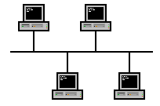

# Netzwerk Topologien

Es gibt verschiedene Netzwerk Topologien, wobei die Topologie *Stern* am meisten vorkommt und auch die meisten Vorteile mit sich bringt. Die anderen Topologien, *Ring* und *Bus*, haben nur sehr spezifische Nutzen und sind außerhalb davon eher schlecht.

## Stern

Jedes *Endgerät* ist mit dem *Verteiler* verbunden, die Endgeräte sind untereinander nicht verbunden. Der Verteiler ist meistens ein *Hub* oder ein *Switch*. Da heutzutage Hubs fast garnicht mehr vorkommen ist die Chance einen anzutreffen eher niedrig.

Die Vorteile von der Stern Topologie sind reichlich:
- Ausfall eines Endgerät hat keinen Einfluss auf das restliche Netzwerk
- hohe Übertragungsrate
- leicht erweiterbar
- leichte Fehlerbehebung (wenn alles nicht funktioniert ist es der Verteiler, wenn ein Endgerät nicht geht ist es das Endgerät bzw. die Verbindung zum Endgerät)

Es gibt aber auch einen Nachteil:
- Ausfall des Verteilers sorgt für Ausfall des gesamten Netzwerkes

## Bus

Bei der Bus Topologie sind alle Endgeräte an einen *Bus* angeschlossen. Dieser Bus ist vergleichbar mit einem Bussystem / Datenbus in einem Computer. Es gibt keine aktiven Komponenten wie Hubs oder Switches, da alle Endgeräte direkt an das Übertragungsmedium angeschlossen sind.

Vorteile:
- geringe Kosten, da nur geringe Kabelmengen erforderlich sind
- einfache Verkabelung und Netzwerkerweiterung

Nachteile:
- leichte Abhörung von Datenübertragungen
- nur ein Gerät kann zu einem Zeitpunkt senden, Geräte müssen also abwarten
- single point of failure: Falls das Kabel an einer Stelle beschädigt und oder unterbrochen ist, ist das gesamte Netzwerk weg. Der Fehler kann an vielen Stellen auftreten und es nicht leicht erkennbar an welcher er aufgetreten ist, somit ist Fehlersuche schwer

Es gibt wenige Anwendungsmöglichkeiten, die vom *Bus* im Vergleich zum *Stern* profitieren. Einer der wenigen Fälle ist ein Feldbus ein einem **Zug** oder einer Bahn, da dort über eine lange Distanz Geräte angeschlossen werden. Durch die Länge wäre es schwer einen zentralen Punkt für einen Verteiler zu wählen an den alle Endgeräte angeschlossen sind. Eine bessere Option wäre eine Kombination aus Stern und Bus: Pro Wagon gibt es einen Verteiler und alle Endgeräte sind in Stern-Form daran angeschlossen. Der Verteiler ist dann an ein Bussystem angeschlossen, welches alle Verteiler miteinander verbindet. **Produktionsstraßen** können auch manchmal gut von einem *Bus* Gebrauch machen. Eine generelle Anforderung an ein Bus oder Ring System ist es, dass das System nicht mit normalen Benutzern in Verbindung steht, dies ist in beiden Beispielen gewährleistet. Zusätzlich sollte es sich um ein relativ isoliertes Environment handeln (wie eine Produktionsstraße), in dem der Ausfall von Geräten vorgebeugt werden kann.

## Ring

Jedes Endgerät ist mit genau 2 weiteren Endgeräten verbunden, wodurch sich ein Kreis bzw. *Ring* formt. Die zu übertragenden Informationen werden von Teilnehmer zu Teilnehmer geschickt, bis sie ihr Ziel erreicht haben. Beim Ausfall eines einzelnen Endgerätes wird der Ring unterbrochen. Als Gegenmaßnahme gibt es etwas namens *Protection-Umschaltung*, wobei es theoretisch 2 Ringe gibt. Der zweite Ring geht in die entgegengesetzte Richtung des ersten Ringes. Bei Ausfall eines Endgerätes werden dann alle Daten, sobald sie den Ort des Ausfalls erreicht haben über den zweiten Ring zurück geschickt, wodurch sie immernoch ihr Ziel finden können, solange es nicht das ausgefallene Endgerät ist. Wenn 2 Endgeräte ausfallen, ist der Netzwerkabschnitt zwischen ihnen komplett vom restlichen Netzwerk getrennt und somit unerreichbar. Es gibt oft ein *Token System*, welches dafür sorgt, dass nur ein Endgerät gleichzeitig senden kann, wodurch Überschreibungen vorgebeugt werden. Das bedeutet, dass die Bandbreite die jedes Endgeräte maximal zur Verfügung hat die Bandbreite des Netzwerks geteilt durch die Anzahl der Endgeräte ist.

Vorteile:
- alle Endgeräte arbeiten als Verstärken bzw. Repeater, wodurch diese nicht extra nocheinmal vorkommen müssen
- jedes Endgerät hat eine garantierte Übertragungsbandbreite; dies kann aber auch ein Nachteil sein, falls das Gerät diese Bandbreite überhaupt nicht braucht und somit anderen Geräten wichtige Bandbreite "klaut"

Nachteile:
- Ausfall eines Gerätes kann das gesamte System zum Ausfall bringen, Ausfall von 2 Geräten bringt das System immer zum Ausfall, zumindest für einen gewissen Abschnitt des Netzwerkes, da dieser Teil vom restlichen Netzwerk abgeschnitten ist durch die 2 ausgefallenen Systeme.
- hohe Latenz zu weiter entfernten Endgeräten
- leichte Abhörung von Daten
- langsame Datenübertragung bei vielen Endgeräten

Die *Ring Topologie* wird eigentlich nicht verwendet, wiedermal nur in einigen isolierten Environments wie Produktionsstraßen. Alles was mit normalen Endgeräten zu tun hat nutzt den Ring nicht.