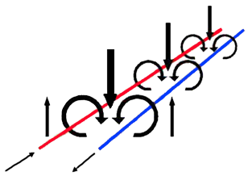

# Twisted Pair - Kupferkabel

*Twisted Pair*-Kabel (kurz TP-Kabel) bestehen aus Kupfer und werden im Tertiärbereich verwendet. TP Kabel können auf Grund ihrer Dämpfung eine maximale Länge von **100m** haben. 

## Aufbau

Ein Twisted Pair Kabel besteht aus *8 Leitern*, von denen immer jeweils zwei miteinadner verdrillt sind, also gibt es *4 Paare*. Diese Verdrillung ist weichtig, da bei hohen Übertragungsraten *cross talk* ein großes Problem wird. Um *cross talk* zu reduzieren, fliest der Strom in den verdrillten Leitern in entgegengesetzte Richtung, sodass sich die Magnetfelder aufheben.

Die einzelnen Paare können zusätzlich auch noch, ähnlich wie das gesamte Kabel, durch ein Drahtgeflecht oder eine Folie ummantelt und geschützt werden.

## Kategorien

TP-Kabel kommen in vielen verschiedenen Kategorien (*Cat* $\hat{=}$ *Category* / Kategorie), welche von *Cat 5* bis *Cat 8* reichen. Die Kategorien unterschieden sich eigentlich nur in Frequenz und Datenrate. Eine Ausnahme hierbei ist *Cat 8*, da es nicht wie alle zuvorkommenden Kategorien auf eine maximale Länge von **100m** ausgelegt ist, sondern nur auf **30m**. Sonst gilt desto "höher" die Kategorie, desto leistungsfähiger das Kabel.

## Bezeichnungen

Das *Shielding*, welches bei dem Twisted Pair Kabel verwendet wird, wird in der Form **`XX/ZYY`** angegeben.

| Abkürzung    | Beschreibung              |
| ------------ | ------------------------- |
| **XX**/YZZ   | **Gesamtschirmung**       |
| **U**/YZZ    | Unshielded                |
| **F**/YZZ    | Foiled (Folienschirm)     |
| **S**/YZZ    | Screened (Geflächtschirm) |
| **SF**/YZZ   | Foiled und Screened       |
| XX/**Y**ZZ   | **Paarschirmung**         |
| XX/**U**ZZ   | Unshielded                |
| XX/**F**ZZ   | Foiled                    |
| XX/SZZ       | Screened                  |
| XX/Y**ZZ**   | **Kabeltyp**              |
| XX/Y**TP**   | Twisted Pair              |
| XX/Y**QP**   | Quad Pair                 |

## Berechnung

Die Berechnungen können am besten an Beispielen verdeutlicht werden.

### Zeit pro Bit auf Leitung

$v = 0.8c$ (Ausbreitungsgeschwindigkeit)
$c = 3 \cdot 10^8\frac{m}{s}$ (Lichtgeschwindigkeit)
$f = 1000MHz$ (Frequenz der Bits)
$L = 100m$ (Länge des Kabels)

> Als erstes berechnet man die Zeit zwischen den Bits aus **f**: $f = \frac{1}{t} \implies t = \frac{1}{f}$

$t = \frac{1}{1000MHz}=1ns$

> Dies ist jetzt allerdings die Zeit für 2 bit also muss t noch durch 2 geteilt werden.

$tpb = \frac{t}{2}=0.5ns$ 

> Alle $0.5ns$ wird ein Bit gesendet

> Nun berechnet man die Zeit $tl$ die ein Bit für die $100m$ benötigt

$tl = \frac{L}{v}= \frac{100m}{0.8 \cdot 3 \cdot 10^8 \frac{m}{s}}=4166 \cdot 10^{-7}s$

> Als letztes berechnet man wieviele Bits $n$ gesendet werden, bevor das erste gesendete die Leitung wieder verlässt

$n  = \frac{tl}{tpb}= \frac{4166 \cdot 10^{-7}s}{0.5 \cdot 10^{-9}s}=833bit$

> Es können also **833bit** gesendet werden, bevor das erste bit die Leitung wieder verlässt.

### Dämpfungsmaß

Die Dämpfung eines Kabels ist von mehreren Faktoren abhängig: von der *Länge*, der *Frequenz*, sowie dem *Material* des Kabels. Das Ausmaß der Dämpfung kann für *Signalspannung* und *Signalströme* mit folgenden Formeln berechnet werden.

$D = 20 \cdot \log(\frac{U1}{U2})$

$D = 20 \cdot \log(\frac{I1}{U2})$

> Um nun die Auswirkung von einer gegebenen Dämpfung $D$ zu berechnen, muss man die Formel zum Quotienten umstellen.

$D = 20 \cdot \log(\frac{U1}{U2}) \implies \frac{D}{20}=\log(\frac{U1}{U2}) \implies 10^{\frac{-D}{20}}=\frac{U1}{U2}$

### NEXT-Wert

Der *near end crosstalk* Wert gibt an, wie hoch die Interferenzen zwischen den Leitungen am Ende der Leitung ist. Ein zu hoher NEXT-Wert kann eventuell ein Indikator dafür sein, dass zu viel des Twisted Pair Kabels nicht verdrillt ist. 

Formel:

$a = 10 \cdot \log(\frac{P1}{P2})$
