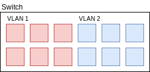

# VLAN

*VLANs* (Virtual Local Area Networks) sind eigenständige LANs, die nicht auf physikalischen "Grenzen" basieren. Sie sind rein logisch und dienen zur Trennung von Endgeräten nach Kategorie (wie z.B. Drucker, Server, Workstations, ...). Ein VLAN definiert eine Broadcast Domain. Broadcasts von Geräten können nur innerhalb des VLANs empfangen werden; genauso Unicast Traffic, er kann nur an Mitglieder des VLANs geschickt werden. Unicast Traffic ist nicht außerhalb des LANs *routable* und kann somit nicht über die Grenze eines LANs hinweg verschickt werden, um soetwas zu erreichen bräuchte man einen Layer 3-fähigen Switch, der dann mehrere VLANs miteinander verbinden könnte.

Es gibt 2 Technologien (*portbasierte VLANs* und *protokollbasierte VLANs*) die bei der Implementation von VLANs verwendet werden.

## Portbasierte VLANs

Bei *Portbasierten VLANs* wird einfach gewissen Ports ein bestimmtes VLAN zugeortnen und Endgeräte die einen gewissen Port nutzen sind dadurch auch direkt einem VLAN zugeordnet. Der Switch wird in mehrere rein logische Switches segmentiert.

Mit der Außnahme von *Trunk Ports* hat jeder Port nur ein zugeortnetes VLAN. Trunk Ports sind dafür da mehrere Switches miteinander zu verbinden, wobei man alle VLANs über ein oder mehrere Ports führen will, damit man nicht für jedes existierende VLAN ein physikalisches Kabel verwenden muss. Hier kommt dann das *VLAN tagging* ins Spiel um die Frames dann wieder den richtigen VLANs zuzuordnen.

## Protokollbasierte VLANs

Protokollbasierte VLANs entscheiden nicht abhängig vom Port in welchem VLAN ein Endgerät ist, sondern anhand der jeweiligen MAC Adresse des Endgerätes, wozu es gehört. Man ordnet bestimmte MAC Adressen den VLANs zu. 

## VLAN tagging

Das *VLAN tagging* ist ein Verfahren für die Zuordnung von Ethernet Frames zu VLANs. Jeder Frame hat ein zusätzliches Datenfeld, in dem Informationen über das VLAN stehen. Diese Frames mit VLAN tag können von den meisten Endgeräten nicht verstanden werden, daher entfernt der Switch vor dem weiterschicken jegliche VLAN tags. Das gesamte Routing der Frames mit VLAN tag wird von Switches übernommen. VLANs können über mehrere Switches reichen, dies ist umgesetzt indem jeder Switch einfach identische VLANs konfiguriert hat. Die Konfiguration der VLANs wird auch oft von den Switchen von selbst miteinander ausgetauscht, wodurch alle immer die korrekten VLAN Definitionen haben.

Der VLAN tag ist insgesamt 4 Byte lang und besteht aus dem *Tag Protocol Identifier* (TPID) und *Tag Control Information* (TCI). Der VLAN tag wird zwischen dem *Source MAC Adress*-Feld und dem *EtherType*-Feld eingefügt. Da das Einfügen eines VLAN tags den Frame verändert muss die Frame Check Sequence (FCS) neu berechnet werden.

Der *TPID* steht an der Stelle an der sonst das EtherType-Feld wäre, und muss sich daher von diesem unterscheiden, um den Frame eindeutig als VLAN tagged Frame erkennbar zu machen. Daher hat der TPID immer den Wert `0x8100` (*IEEE 802.1Q-tagged frame*).

Die *TCI* besteht aus 3 seperaten Teilen.
- **Priority Code Point** (PCP | 3 bit): Gibt die Priorität von bestimmten Frames an
- **Drop Eligible Indicator** (DEI | 1 bit): Gibt an, ob der Frame im Fall von hoher Netzwerkauslastung eventuell gedropped werden kann
- **VLAN Identifier** (VID | 12 bit): Gibt an, in welchem VLAN der Frame ist. Die Werte `0x000` und `0xFFF` sind reserviert, daraus ergibt sich, dass es maximal 4094 VLANs in einem Netzwerk geben kann. Der reservierte Wert `0x000` gibt an, dass der Frame zu keinem VLAN gehört. Damit ist der Tag dann laut Definition nurnoch ein *Priority Tag* anstatt eines *VLAN Tag*. 