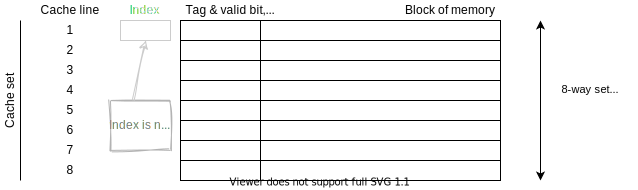

# CPU Caching

## Types of cache misses

- **Compulsory miss**
  - Cold start, first reference
  - Data block was not cached before

- **Capacity miss**
  - Not all required data fits into the cache
  - Accessed data was previously evicted to make room for different data

- **Conflict miss**
  - Collision, interference
  - Depending on the cache organization, data items interfere with each other
  - Fully associative caches are not prone to conflict misses

## Policies

On cache hit:
- **Write-through**
  - Main memory is always up-to-date
  - Writes may be slow
- **Write-back**
  - Data is written only to the cache
  - Main memory temporarily inconsistent

On cache miss:
- **Write-allocate**
  - To-be-written data item is read from main memory into the cache
  - Write performed afterwards according to the write policy
- **Write-to-memory**
  - Modification is performed only in main memory

## Potential problems of caching strategies

- **Ambiguity Problem**
  After a context switch it is unclear if the data found in the cache is referring to your address space or the address space of the previous process.
  This can be solved by associating the physical address with the cache entry.
- **Alias(ing) Problem**
  Valuable cache space is wasted because multiple entries refer to the same physical memory region without this being detected.

## Tag and index

The *index* and *tag* are somehow (meaning some kind of hash function is used) computed from the physical or virtual address.

The address used for calculation can differ from cache to cache but it is usually indicated in the description of the cache:

- virtually indexed   **->** virtual address for index
- physically indexeed **->** physical address for index
- virtually tagged    **->** virtual address for tag
- physically tagged   **->** physical address for tag

> Using the physical address for the tag has the advantage that the ambiguity problem can be mitigated because different address spaces will have different tags.

The address often also has an offset which is the last few bytes.
This is because one cache entry does not store only a singular value but a whole block of data at a time and so an offset into this block of data is needed.

### physically indexed, virtually tagged

No cache flush needed when context switching (because ambiguity is not a problem)

Write-back can be complicated especially since the addres space is switched.

Access time depends on the speed of the MMU.

DMA / multi processor things can be tricky to implement.

### physically indexed, physically tagged

all cache related things are completely independant of CPU inner workings (context switches, ...).

Access time depends on the speed of the MMU.

DMA / multi processor things are super easy.

You might need to do page coloring (/recoloring) to get better cache usage because of conflicting entries.

#### Page coloring

Two addresses (/blocks of memory) have the same color if and only if they map to the same cache line.

The strategy is to assign different colors (by modifying the placement when creating pages) so that pages that were allocated right after each other map to different cache lines.
Using this the chance of just reusing the same cache line over and over again (overwriting it each time) is reduced to a minimum.

> Why talk about pages now when the cache does not cache whole pages but only significantly smaller blocks of memory (maybe 64 bytes at a time or something similar, nowhere near the size of a page)?

## Types of caches

### n-way set associative cache

In a n-way set associative cache the index is used to get to the correct cache set.
From there on the tags are compared to find the correct cache line.

If that fails you've got a cache miss; if you find a matching tag you've got a cache hit.

### Fully-associative cache

A fully-associative can be seen as a "|cache|"-way set associative cache, meaning that the cache consists of a giant all encompassing cache set.
Since only one cache set exists the index is no longer needed as it's purpose was to identify the correct cache set.

### Direct mapped cache

A direct mapped cache can be seen as a 1-way set associative cache, meaning that there is only one element per cache set resulting in each index uniquely identifying one cache line.

Unlike what you might think based on the fully-associative cache the cache tag still **exists** in a direct mapped cache to be circumvent the aliasing problem.
