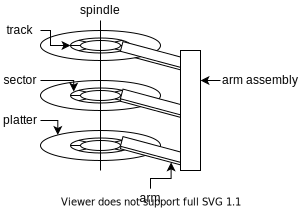

# Device Management & Storage devices

## Device Management

The general objectives of device management are:

- **abstracting** away from details of physical devices into a more uniform api
- **uniform addressing/naming** that does not depend on hardware details
- **serialization** of I/O-operations by concurrent applications
- **protection** of standard devices against unauthorized accesses
- **buffering**, if data from/to a device cannot be stored in the final destination
- **error handling** of sporadic device errors
- **virtualizing** physical devices via memory and time multiplexing (e.g., pty, RAM disk)
  - **spooling**, **uniform api**, **request scheduling**

### Types of I/O devices

- **block devices**:
  - hard drives, ssds, ...
  - `read`, `write`, `seek`
  - raw I/O or filesystem access
  - memory-mapped file access possible
- **character devices**:
  - most often keyboards, mice, serial ports, ...
  - `get`, `put`
  - often heavily abstracted by libraries
- **network devices**:
  - specific communication patterns and addressing schemes require own interface
  - usually addressed with socket interface
  - seperates network protocol from network operation

### Memory-mapped I/O

I/O devices are directly mapped to some memory addresses which can be accesses using standard memory operations.

### Port-mapped I/O

Special instructions are used to send / receive data from ports.
These ports function similar to registers in some ways.

### Programmed I/O

While a certain I/O operation is being done the thread is busy-waiting for the response.
The kernel thread is polling the state of I/O devices: ready, busy, error

### Interrupt-driven I/O

Asynchronously started and later received using interrupt.
The interrupt handler will then process the response accordingly:
- disable other interrupts
- save registers not alrady saved by hardware interrupt mechanism
- switch address space if necessary
- set up stack for interrupt service procedure
- handle interrupt:
  - find out which thread needs to be activated or which kernel code to run
  - activate the required thread / run the required kernel code
- enable other interrupts

### DMA - Direct Memory Access

DMA module controls exchange of data between main memory and I/O device.
This bypasses the CPU entirely when transfering data from I/O devices to memory.
Processor interrupted after entire block has been transferred.

## Storage devices

### Hard drives

Reading from disk involves the following step:

Seek:
- **speedup**: accelerate arm to max. speed or half way point
- **coast**: at max. speed (for long seeks)
- **slowdown**: stops arm near destination
- **settle**: adjust head to actual desired track (~1ms)

Writing requires a more accurate head position than reading because for reading you can rely partially on checksums to fill in the missing details which arise from a slightly incorrect head position.

With writing you can't do that as the actual location you write something to cannot be off by a tiny amount.

### Solid State Drives

Don't contain any moving parts, consume less power than regular hard drives and don't have a seek time or similar.

The amount of read and write requests is limited per block. A block wears out after about 10,000 erasures for Multi-level cells and 100,000 for single-level cells.
The SSDs memory controller is a **flash translation layer** (FTL) which keeps track of wear of cells and buffers requests as well as making sure cells are used equally by redirecting requests to different blocks.

FTL can impact performance, especially random writes.

Everytime something is written to a block it first has to be erased, this can take a long time (about 2ms) and then the new data has to be written.
To minimize the performance impact of this spare blocks are used.
These are blocks which have already been erased and can just be written to without having to erase them first.
Periodically unused blocks are garbage collected and erased in order to increase the amount of spare blocks.
This has to be initiated by the operating system using the trim command which tells the SSD which logical blocks are unused.

### RAID - Redundant Array of Inexpensive Disks

- **RAID 0**:  Striping across 2 disks.
- **RAID 1**:  Bitwise mirroring across 2 disks.
- **RAID 2**:  Striping over multiple disks with added hamming codes.
- **RAID 3**:  Striping on a byte/word-level with interleaved parity.
- **RAID 4**:  Block-interleaved parity. Compute parity for a small block of data and put it on a specially choosen parity disk.
- **RAID 5**:  block-level distributed parity. Same as Raid 4 but with distributed parity to reduce load on the parity disk.
- **RAID 10**: Mirroring and then striping. Fails if 2 drives in the same group fail (good).
- **RAID 01**: Striping and then mirroring. Fails if 2 drives in 2 stripes fail (bad).

