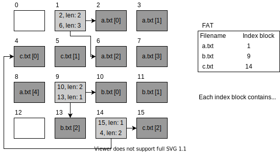

# Filesystems

The goals of file management are:
- Provide a convenient naming scheme for files
- Provide a uniform I/O support for a variety of storage device types
- Provide standardized set of I/O interface functions
- Minimize/eliminate loss or corruption of data
- Provide I/O support and access control for multiple users
- Enhance system administration (e.g. backups)
- Provide acceptable performance

### How programs interact with files

When a process opens a file it gets a so called *file descriptor*.
This is an int which corresponds to a *file description*.

Each process has a list of open files identified by file descriptors (*process table*).
The whole system has a list called the *openfile table* which stores all opened files globally.
The list each process has has references to this openfile table.
The openfile table has pointers to the *vnode table* which then contains the inode for each file as well as other useful information such as the refcount.
The distinction between openfile table and vnode table is that the openfile table would have 2 entries for hardlinked (and opened) files while the vnode table uses the inode as it's primary key you could say.

## File metadata

The following is a list of possible metadata a file could have.
Different filesystems allow / have different kinds of metadata; this is a list of practical entries.

| Attribute           | Meaning                                |
| :------------------ | :------------------------------------- |
| Protection          | Who can do what with the file          |
| Creator             | Who created it                         |
| Owner               | Who currently owns it                  |
| Read-only flag      | Is it somehow read-only (in general; not related to specific user permissions)? |
| Hidden flag         | Is it hidden?                          |
| System flag         | Is it a system file which should be protected from normal users? |
| Lock flags          | Did some application lock the file?    |
| Creation time       | When was it created?                   |
| Time of last access | When was it last opened (read from)?   |
| Time of last update | When was it last updated (written to)? |
| Current size        | What is it's current size (actual vs. on disk)? |
| Maximum size        | What is it's maximum size if it has any (filesystem limitation)? |

## Interfacing with the filesystem

The operating system hides a lot of the complexity behind storage mediums behind a simple to use file api.

`create()`, `write()`, `read()`, `reposition()`, `delete()`, `truncate()`, `open()`, `close()`

> These are libc wrapper functions for syscalls, functions such as `fopen()` which have more "features" also exist.

## Filesystem approaches

The filesystem must keep track of where every file is located on disk:
- Which logical block belongs to which file?
- In what order are the blocks that form the file?
- Which blocks are free for the next allocation?

### Contiguous Allocation

Array of n contiguous logical blocks reserved per file (to be created)

Minimum meta data per entry in *FAT* (File Allocation Table) / directory:
- Starting block address
- number n

It's difficult to know what value of n would be good at the start, some files might start out really small but get larger over time.
This needs to be somehow accounted for.
You could just increase n but this would cause a possible overlap between files:
- overallocate place
- move other file out of the way

Both solutions are bad and the result is both internal and external fragmentation like with pages.

Compactification is sometimes needed because of external fragmentation.

### Chained Allocation

Giant linked list where each block has a pointer to the next file block.

The FAT contains a pointer to the initial block of each file.

External fragmentation is eliminated as all blocks can be used but locality is lost completely and arbitrary access is super slow.

Sequential reads are not too bad, individually reading a block is super slow as all previous blocks need to be read first to even know where the requested block of the file would be located.

### Linked Allocation

> Sometimes this is also called chained allocation and sometimes chained allocation is called linked allocation.

With linked allocation the linked list that would be saved distributed over a whole lot of file blocks with chained allocation is saved at a single location.
Additionally the linked list is cached in RAM.
This means that accessing random file blocks is not too slow as the linked list only needs to be traversed in RAM and then a single read operation needs to be done.
Disk locality is still not utilized.

The FAT contains/is the linked list.

This approach has the drawback that with larger and larger storage devices the FAT also increases a lot in size resulting in unfeasably large FATs.
This means that the RAM-only part is turned into a cache and things still need to be looked up on disk.
In addition the FAT on disk grows really large.

### Indexed Allocation

FAT (or special inode table) contains a one-level index table per file

This index table has a start block and a length.
It is basically a mixture of contiguous allocation and linked allocation

Besides using single-level-indexing you can also use multi-layer-indexing where instead of pointing directly to file blocks each index block can also be indirection block.

Usually you don't go any further than triple indirection.

Direct blocks are normal index tables.
Single indirect blocks are blocks which point to multiple direct blocks.
And so forth with double and triple indirect blocks pointing to the predecessor respectively.

### Comparison

| characteristic               | contiguous | chained     | indexed          |
| ---------------------------- | ---------- | ----------- | ---------------- |
| preallocation?               | necessary  | possible    | possible         |
| fixed/varable fragment size? | variable   | fixed       | fixed / variable |
| fragment size                | large      | small       | small / medium   |
| allocation frequency         | once       | low to high | high  / low      |
| time to allocate             | medium     | long        | short / medium   |
| FAT size                     | one entry  | one entry   | large / medium   |

### Caching strategies

As for buffering and caching you can do something called **write behind**.

With write behind you first cache / buffer all write operations and then at a later point in time write them to disk.

This reduces the wear and tear for disks (especially for solid state drives) but comes with the disadvantage of not being very crash friendly.

### Journaling file systems

All operations that are performed on a disk are journaled as transactions.
This means that in the event of a failure while writing something to disk you can just role back to before the transaction started.
This does not mean that no data is going to be lost but it at least garantees that no inconsistent state is generated.

After completion of an operation the transaction is removed from the log, using this it can easily be deduced which operations need to be rerun after a crash as only the ones which still exist in the journal haven't been executed properly yet.

### Log structured file systems

When using a journal you basically do everything twice (at least when it comes to metadata; actual file contents aren't logged in the journal) and so log structured filesystems do away with this.
They use nothing but a log in which everything is written.
Using this you've basically come full circle.

