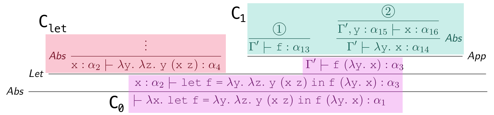

# Lambda Typisierung

## Regeln

### Constant

$$
\text{CONST}\frac{c \in \text{Const}}{\Gamma \vdash c : \tau_c}
$$

### Variable

$$
\text{VAR}\frac{\Gamma(x) = \tau}{\Gamma \vdash x : \tau}
$$

$$
\text{VAR}\frac{\Gamma(x) = \tau' \succeq \tau}{\Gamma \vdash x: \tau}
$$

### Abstraction

$$
\text{ABS}\frac{\Gamma, x: \tau_1 \vdash t : \tau_2}{\Gamma \vdash {\lambda}x.t : \tau_1 \to \tau_2}
$$

### Application

$$
\text{APP}\frac{\Gamma \vdash f: \mathbf{\tau} \to \tau \qquad \Gamma \vdash x : \tau_2}{\Gamma \vdash f x : \tau}
$$

### Let-Polymorphism

$$
\text{LET}\frac{\Gamma \vdash t_1 : \tau_1 \qquad \Gamma, x: \text{ta}(\tau_1, \Gamma) \vdash t_2: \tau_2}{\Gamma \vdash \text{let } X = t_1 \text{ in } t_2 : \tau_2}
$$

## Constraints pro Regel

$$
\text{CONST}\frac{2 \in \text{Const}}{\Gamma \vdash 2 : \alpha} \text{ ergibt } \alpha = \text{int}
$$

$$
\text{VAR}\frac{(\Gamma, x: \alpha_1)(x) = \alpha_2}{\Gamma, x: \alpha \vdash x: \alpha_2} \text{ ergibt } \alpha_1 = \alpha_2
$$

$$
\text{ABS}\frac{\alpha_2 \vdash \alpha_3}{\alpha_1} \text { ergibt } \alpha_1 = \alpha_2 \to \alpha_3
$$

> Das $\alpha_2$ steht bei **ABS** wohlmöglich nicht direkt da, dann muss man es sich aus dem $\Gamma$ holen.

$$
\text{APP}\frac{\vdash \alpha_2 \quad \vdash \alpha_3}{\alpha_1} \text { ergibt } \alpha_2 = \alpha_3 \to \alpha_1
$$

$$
\text{LET}\frac{\Gamma \vdash t_1 : \alpha_1 \qquad \Gamma' \vdash t_2 : \alpha_2}{\Gamma \vdash \text{let } x = t_1 \text{ in } t_2 : \alpha_3} \text { ergibt  } \alpha_2 = \alpha_3
$$

- Sammle Constraints aus linkem Teilbaum in $C_\text{let}$
- Berechne $\sigma_\text{let}$ aus $C_\text{let}$
- Berechne $\Gamma' := \sigma_\text{let}, x: \text{ta}(\sigma_\text{let}(\alpha_1), \sigma_\text{let}(\Gamma))$
- Benutze $\Gamma'$ im rechten Teilbaum, sammle Constraints in $C_1$
- Constraints: $\C'_\text{let} \cup C_1 \cup \lbrace \alpha_2 = \alpha_3 \rbrace$<br />
  ($C'_\text{let} := \lbrace \alpha_n = \sigma_\text{let}(\alpha_n) \;\vert\; \sigma_\text{let} \text{ definiert für } \alpha_n \rbrace$)



## Robinson Algorithmus zur Unifikation

```
if C == {} then []
else let {θ_l = θ_r} ∪ C' = C in
  if θ_l == θ_r then unify(C')                                             # 1
  else if θ_l == Y and Y ∉ FV(θ_r) then unify([Y => θ_r] C') ∘ [Y => θ_r]  # 2
  else if θ_r == Y and Y ∉ FV(θ_l) then unify([Y => θ_l] C') ∘ [Y => θ_l]  # 3
  else if θ_l == f(θ^1_l, ..., θ^n_l) and θ_r == f(θ^1_r, ..., θ^n_r)      # 4
    then unify(C' ∪ {θ^1_r = θ^1_l, ..., θ^n_r = θ^n_l}) 
  else fail

# FV(t) := Menge der freien Variablen von Term t

# 1. linke & rechte Seite gleich, moving on
# 2. ersetze rechte Seite durch linke Seite, rechts darf nicht
#    linke Seite (Y) als freie Variable enthalten
# 3. ersetze linke Seite durch rechte Seite, links darf nicht
#    rechte Seite (Y) als freie Variable enthalten
# 4. function call, unifiziere Argumente
```

Allgemeinster Unifikator: $\sigma$ mgu, falls $\forall$ Unifikator $\gamma$ $\exists$ Substitution $\delta$: $\gamma = \delta \circ \sigma$
