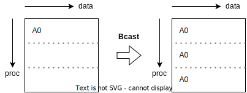
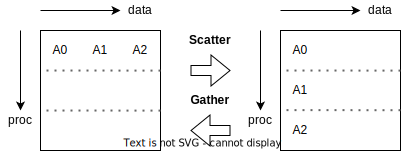
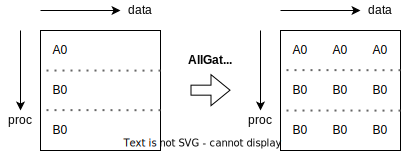
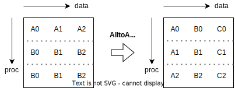
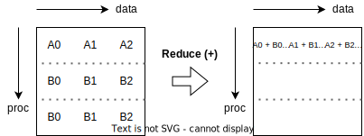
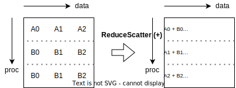
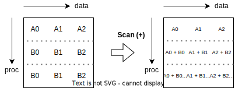

# MPI Send und Receive

## Blocking send and receive

Ein Receive für alle Arten von blocking send:

```c
MPI_Recv(
  void* buf, int count, MPI_Datatype type,
  int source, int tag, MPI_Comm comm, MPI_Status* status
);
```

| Name                      | Function    | Eigenschaft              |
| ------------------------- | ----------- | ------------------------ |
| Standard blocking         | `MPI_Send`  | Implementierungsabhängig |
| Buffered blocking         | `MPI_Bsend` | Buffer, niemand wartet   |
| Synchronous blocking send | `MPI_Ssend` | Beide Seiten warten      |
| Ready blocking send       | `MPI_Rsend` | Receive muss schon gecalled worden sein, blockiert bis Übertragung vollständig |

```c
MPI_[ε|B|S|R]send(
  void* buf, int count, MPI_Datatype type,
  int destination, int tag, MPI_Comm comm
);
```

> Man kann `MPI_ANY_TAG` und `MPI_ANY_SOURCE` anstelle von `tag` bzw. `source` bei receive verwenden.

## Non-blocking send and receive

```c
MPI_Isend(
  void* buf, int count, MPI_Datatype type,
  int destination, int tag, MPI_Comm comm, MPI_Request* request
);

MPI_Irecv(
  void* buf, int count, MPI_Datatype type,
  int source, int tag, MPI_Comm comm, MPI_Request* request
);
```

> Man kann `MPI_ANY_TAG` und `MPI_ANY_SOURCE` anstelle von `tag` bzw. `source` bei receive verwenden.

## Check/Warten für Übertragung

Non-blocking: `MPI_Test(MPI_Request* request, int* flag, MPI_Status* status);`<br />
=> flag == 0, noch nicht abgeschlossen<br />
=> flag == 1, fertig

Blocking: `MPI_Wait(MPI_Request* request, MPI_Status* status)`<br />
=> blockiert bis fertig

# MPI Global Collective Operations

## Broadcast

```c
MPI_Bcast(
  void* buf, int count, MPI_Datatype type,
  int source, MPI_Comm comm
);
```

Broadcast ist eine kollektive Operation, es muss nicht extra mit `MPI_Recv` empfangen werden.

Bei den Empfängern wird `buf` als `recvbuf` benutzt, beim Sender als `sendbuf`.



## Scatter

Sendet Daten eines Prozesses zu allen Prozessen (inkl. Sender selber), hierbei werden die Daten auf die einzelnen Prozesse aufgeteilt in Abhängigkeit von `recvcount`.

```c
MPI_Scatter(
  void* sendbuf, int sendcount, MPI_Datatype type,
  void* recvbuf, int recvcount, MPI_Datatype type,
  int sender, MPI_Comm comm
);
```

> Wahl von sendbuf, sendcount nur für `sender` relevant.



## Gather

Sammelt Daten von allen Prozessen und speichert sie beim `receiver`.

> Das Inverse von Scatter.

```c
MPI_Gather(
  void* sendbuf, int sendcount, MPI_Datatype type,
  void* recvbuf, int recvcount, MPI_Datatype type,
  int receiver, MPI_Comm comm
);
```

> Wahl von recvbuf, recvcount nur relevant für `receiver`.

Jeder Prozess (`receiver` auch) sendet den Content seines Buffers an den `receiver`, wo dieser dann in rank order gespeichert wird in `recvbuf`.

Das folgende ist äquivalent zu MPI_Gather:

`MPI_Send(sendbuf, sendcount, type, root, ...)` und<br />
`MPI_Recv(recvbuf + i * recvcount * extent(type), i, ...)` für alle Prozesse i


## Allgather

Sammelt alle Daten von allen Prozessen und distributiert die kombinierten Daten dann wieder auf alle Prozesse, quasi ein Gather gefolgt von einem Broadcast.

> The block of data sent from the jth process is received by every process and placed in the jth block of the buffer recvbuf.

Nach dem Aufruf hat jeder Prozess die Konkatenation der Daten aller Prozesse in rank order.

```c
MPI_Allgather(
  void* sendbuf, int sendcount, MPI_Datatype type,
  void* recvbuf, int recvcount, MPI_Datatype type,
  MPI_Comm comm
);
```



## AllToAll

Transponiert quasi eine Matrix.

Der jte Block vom iten Prozess ist nach AllToAll der ite Block vom jten Prozess.

```c
MPI_AlltoAll(
  void* sendbuf, int sendcount, MPI_Datatype type,
  void* recvbuf, int recvcount, MPI_Datatype type,
  MPI_Comm comm
);
```



## Reduce

Wendet eine kommutative Operation auf die Daten an und speichert das Ergebnis im `root` Prozess.

Hierbei werden jeweils die iten Block aller Prozesse miteinander verrechnet und das Ergebnis landet im iten Block des `root` Prozesses.

```c
MPI_Reduce(
  void* sendbuf,
  void* recvbuf, int count, MPI_Datatype type,
  MPI_Op op, int root, MPI_Comm comm
);
```

Die möglichen Operationen (per Default) sind:
- `MPI_SUM`: sum of all elements
- `MPI_PROD`: product of all elements
- `MPI_LAND`: logical and across all elements
- `MPI_LOR`: logical or across all elements
- `MPI_BAND`: bitwise and across all elements
- `MPI_BOR`: bitwise or across all elements
- `MPI_MIN`: minimum of all elements
- `MPI_MAX`: maximum of all elements
- `MPI_MINLOC`: minimum of all elements and rank of corresponding process
- `MPI_MAXLOC`: maximum of all elements and rank of corresponding process




## AllReduce

Ein Reduce gefolgt von einem Broadcast.

```c
MPI_Allreduce(
  void* sendbuf,
  void* recvbuf, int count, MPI_Datatype type,
  MPI_Op op, MPI_Comm comm
);
```


## ReduceScatter

Ein Reduce gefolgt von einem Scatter (mit `sendcount = 1`).

```c
MPI_Reduce_scatter(
  void* sendbuf,
  void* recvbuf, int recvcounts[], MPI_Datatype type,
  MPI_Op op, MPI_Comm comm
);
```



## Scan

```c
MPI_Scan(
  void* sendbuf,
  void* recvbuf, int count, MPI_Datatype type,
  MPI_Op op, MPI_Comm comm
);
```



# Sonstige MPI Funktionen

`MPI_Comm_size(MPI_Comm comm, int* num_procs);`

`MPI_Comm_rank(MPI_Comm comm, int* own_rank);`

`MPI_Init(int* argc, char*** argv);`

`MPI_Barrier(MPI_Comm comm, MPI_Request *request);`

`MPI_Finalize();`

