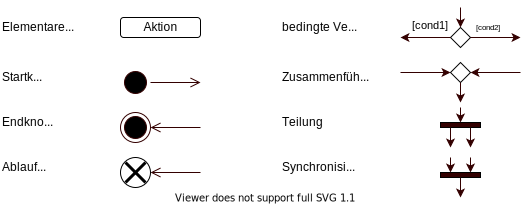
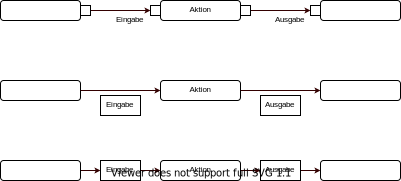

# Aktivitätsdiagramme

Das Aktivitätsdiagramm beruht darauf, dass man einen sogenannten Token (/Marke) hat, welcher
das Ativitätsdiagramm traversiert. Durch bestimmte Operationen können auch mehrere Tokens
gleichzeitig das Aktivitätsdiagramm durchlaufen, diese sollten aber irgendwann wieder
zusammenfinden. Man kann Tokens als Art Thread ansehen, wobei das wieder zusammenführen
oder löschen eines Tokens das warten auf einen anderen Thread (`#join()`) oder das beenden
eines Threads darstellt.

## Basics

Aus diesen elementaren Elementen kann man sich dann Diagramme bauen.

Wie zu erwarten fängt der Ablauf beim **Startknoten** an und endet beim **Endknoten**.

Wenn ein Token zu einer bedingten **Verzweigung** kommt entscheidet er sich abhängig von den
Bedingungen für eine Richtung, bei einer **Zusammenführung** werden dann diese beiden Richtungen
wieder zusammengeführt.

Bei den **Teilungen** wird ein Token in (meist) zwei Tokens aufgeteilt, welche dann einzelnt
das Diagramm durchlaufen können. Wenn ein Token an eine **Synchronisierung** stößt, dann wartet
er bis (meist) ein anderer Token auch an sie stößt. Sobald dies geschehen ist werden die
beiden Tokens dann wieder kombiniert und es läuft genau ein Token weiter.

Es kann auch passieren, dass ein Token zu einem **Ablaufende** kommt, hier wird dieser Token dann
einfach gelöscht, was aber nicht den sonstigen Fluss der anderen Tokens beeinträchtigt. Wenn dies
der letzte Token ist, ist dies gleichbedeutend mit einem **Endknoten**.

**Aktivitäten** können sich wie **Synchronisierungen** verhalten, wenn sie mehrere Eingänge haben
an denen alle verschiedene Tokens ankommen können. Sie warten nämlich dann darauf, dass alle möglichen
Tokens ankommen und werden nur dann ausgeführt sobald dies der Fall ist. Am Ende kommt wiedermal auch
nur ein Token heraus.

## Objektknoten

Wenn man besonders darauf hinweisen will was für Daten in eine Aktivität rein gehen und welche raus
gehen kann man dies duch die sogenannte **Objektknoten**-Notation tun. Dies ist sinnvoll, da man so
leicht erkennen kann wo welche Datenströme vorhanden sind. Dies kann sich auch gut eignen um
Fließbänder bzw. Pipelines darzustellen.

Es gibt mehrere Arten wie man diese Objektknoten darstellen kann. Warum es zwei gibt hat vermutlich
historische Gründe. Die letzte ist nicht unbedingt empfehlenswert für handschriftlich verfasste
Diagramme weil man den Unterschied zwischen runden und eckigen Rechtecken manchmal schlecht erkennen kann
