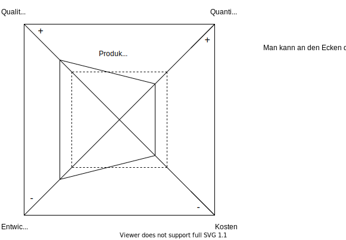

# Aufwandsschätzung

Oft wird gefragt, wie lange den ein Projekt ungefähr dauern wird, wieviele Leute dafür benötigt werden
oder ähnliches. Dabei zumindest gute und begründete Schätzungen machen zu können ist eine hilfreiche Fähigkeit.
Man muss sich damit abfinden, dass es sich immernoch um eine Schätzung handelt und somit das Ergebnis nicht genau
stimmen kann. Aus diesem Grund kann einem das gesamte Thema leicht händewedelig vorkommen.

Oft wird bei der Aufwandsschätzung von **Personenmonaten** (*PM*) geredet, also die Anzahl an Monaten, die eine
einzelne Person brauchen würde. Zusätzlich wird auch manchmal von *PJ*, also **Personenjahren** gesprochen, wobei
aber ein PJ eher 9 bis 10 PM's sind auf Grund von Urlaubstagen.

Es werden oft Schätzungen über die benötigte Menge Code gemacht, meist in *LOC* (**lines of code**) oder *KLOC*
(**1000 lines of code**), wobei man auch immer die Programmiersprache beachten muss, da die Produktivität
stark variieren kann.

Eine Rechnung nur basierend auf der Komplexitätsschätzung ist meistens eher irreführend anstatt nützlich, da
z.B. mit mehr Personal die Effektivität oft sinkt durch höheren Verwaltungsaufwand und mehr benötigte Kommunikation.
Solche Faktoren sind bis jetzt noch garnicht mit in die Rechnung eingefloßen. Somit kann es sinnvoll sein lieber
mit weniger Leuten länger an einem Projekt zu arbeiten.

Einige Einflussfaktoren sind:
- Quantität (also Anzahl LOC, ...)
- Qualität des Quelltextes
- Entwicklungsdauer
- Kosten des gesamten Unterfangen

Hierbei kann man sich vorstellen, dass man nie alles an diesen Eigenschaften maximieren kann, immer nur einen
kleinen Teil.

Das sogenannte Teufelsquadrat zeigt die Auswirkungen, die bestimmte Entscheidungen wie Kosten verringern oder Qualität
erhöhen haben wird.

## Analogiemethode

Bei der **Analogiemethode** geht man hin und vergleicht das neue Projekt mit vorherigen die vielleicht gewisse Ähnlichkeiten
aufweisen und orientiert sich an der Dauer dieses Projektes.

Man muss auch beachten, dass man eventuell einige Komponenten schon in einer ähnlichen Art für ein anderes Projekt
implementiert hatte und diese ohne großen Aufwand übernehmen kann.

Vorteilhaft bei der Analogiemethode ist, dass sie relativ einfach anzuwenden ist, aber sie hat auch den Nachteil, dass
das Resultat sehr subjektiv und ungenaut ist. Ein Softwarehaus hat vielleicht groß andere Erfahrungen mit einer Art von Projekt
gemacht als ein anderes und somit lässt sich das Ergebnis schlecht übertragen.

Die Analogiemethode ist also eine Methode um eine **grobe** Schätzung über den Aufwand abzulegen.

## Relationsmethode

Die Relationsmethode ist ähnlich wie die Analogiemethode in der Hinsicht, dass man sich vorheriges anguckt und daran
versucht eine Abschätzung abzugeben. Der Unterschied tritt in der Umsetzung davon auf. Man hat nämlich einige
Richtlinien und Faktoren die einem die konkretere Einschränkung erleichtern.

Man betrachtet z.B. Programmiersprachen: wieviel Aufwand es ist mit diesen Sprachen umzugehen und wieviele Jahre Erfahrung
die vorhandenen Entwickler mit der jeweiligen Sprache haben. Daraus ergibt sich dann ein Weg wie man das neue Projekt mit
Programmiersprache 1 mit anderen vorherigen Projekten in Programmiersprache 2 vergleichen kann, indem man die Unterschiede
die die Programmiersprache ausmacht durch die erlangten Faktoren herausrechnet.

Neben den Programmiersprachen werden auch andere Charakteristiken wie die benutzten Datenstrukturen mit einbezogen.

Ein kleines Beispiel:

| Sprache        | benötigte Erfahrung |
| -------------- | ------------------- |
| C        = 100 | 7 Jahre =  80       |
| Cobol    = 120 | 3 Jahre = 100       |
| Assembly = 140 | 1 Jahr  = 140       |

Das neue Produkt soll in C implementiert werden wobei das Entwicklungsteam durchschnittlich 3 Jahre Erfahrung mit C hat.

Assembly zu C: 140 zu 100 $\implies$ -40 Punkte

5 Jahre zu 3 Jahre: 80 zu 100 $\implies$ +20 Punkte

Somit ergibt sich, wenn man nur die Programmiersprache beachtet und die anderen Faktoren erstmal links liegen lässt,
dass das neue Projekt etwa 21% weniger Aufwand als das ältere brauchen sollte.

Die Relationsmethode ist schon etwas komplexer und aufwendiger als die Analogiemethode und bietet damit auch eine meist
bessere Abschätzung.

## Phasenaufteilung

Man betrachte vorherige Projekte und schaut sich an, welche Phase prozentual wie lange gedauert hat und nutzt diese
Unterteilung dann um nach Abschluss der ersten Phase eine erste Übersicht über die Dauer des gesamten Projektes zu
bekommen.

Ein Vorteil ist, dass man schon relativ früh (also nach Abschluss einer Phase) eine erste Abschätzung über die Gesamtdauer
des Projektes machen kann. Ein Nachteil ist aber, dass sich gezeigt hat, dass die prozentualen Anteile sehr stark
von Projekt zu Projekt schwanken und somit keine äußerlich gute Schätzung hervorrufen können.

## Planungspoker

Der Planungspoker ist eine Variante der Analogiemethode. Hierbei gibt jeder in einer Gruppe eine erste Schätzung ab
und es wird diskutiert bis man einen Konsensus gebildet hat.

Er gehört auch zur Kategorie der eher ungenaueren Methoden, kann aber eine erste **grobe** Übersicht verschaffen.

## Multiplikatormethode

Das System wird soweit in Teilprodukte zerlegt, bis jedem Teilprodukt ein bereits feststehender Aufwand (in LOC)
zugeordnet werden kann.

Zudem ordnet man meistens die Teilprodukte eine der folgenden Kategorien (kann natürlich auch andere geben) zu:

- Steuerprogramme
- Eingabe-/Ausgabeprogramme
- Datenverwaltungsroutinen
- Algorithmen

Danach gibt man jeder Kategorie eine Gewichtung und summiert somit den gesamten (bewerteten) Aufwand auf.

## COCOMO II

> Constructive Cost Model (2)

COCOMO II geht etwas geplanter und strukturierter an das Problem heran: Es gibt 22 feste Einflussfaktoren, für
welche man einen Wert wählt auf einer Skalar wie zutreffend / beinflussend dieser Faktor ist.

COCOMO II benutzt eine Formel zum berechnen der Personenmonate, welche die 22 verschiedenen Faktoren mit einbezieht:

$$
\text{PM} = A \cdot (\text{Size})^{1.01 + 0.01 \cdot \sum_{j=1}^{5} \text{SF}_j} \cdot \prod_{i=1}^{17} \text{EM}_i
$$

Hierbei ist:

- $A$: Konstante für Kalibrierung des Modells (bspw. für LOC / KLOC, Funktionspunkte der Software)
- $\text{Size}$: geschätzer Umfang der Software in KLOC oder unjustierten Funktionspunkten
- $\text{SF}_j$ Skalierungsfaktoren
- $\text{EM}_i$ multiplikative Kostenfaktoren

$\text{SF}_j$ nimmt einen Wert zwischen 0 und 5 an, wobei 0 für "Extra High" und 5 für "Very Low" steht:

- Precedentedness
- Development Flexibility
- Architecture / Risk Resolution
- Team Cohesion
- Process Maturity

$\text{EM}_i$ ist ähnlich, hat aber eine Skalierung von -1 bis 3 mit einem Standardwert von 1:

**Product**
- Required Software Reliability
- Data Base Size
- Product Complexity
- Developed for Reusability
- Documentation Match to Lifecycle Needs

**Personnel**
- Analyst Capability
- Programmer Capability
- Personell Continuity
- Application Experience
- Platform Experience
- Language and Toolset Experience

**Platform**
- Time Constraint
- Storage Constraint
- Platform Volatility

**Project**
- use of Software Tools
- Multisite Development
- Required Development Schedule

Da alles selber ausrechnen und bewerten nervig sein kann gibt es natürlich [online Rechner](http://softwarecost.org/tools/COCOMO/) die einem diese Arbeit teilweise abnehmen können.
