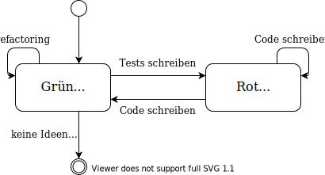

# Prozessmodelle

## nicht-agile Prozesse

Prozessmodelle sind Modelle zur Planung des kompletten Ablaufs, von Planung bis Abnahme des Kunden.

### Programmieren durch Probieren

> trial and error

Besteht fast nur aus Programmieren und aus sehr wenig Planung und ist aufgrunddessen nicht unbedingt das idealste
für Projekte ab einer gewissen Größe.

Der geschriebene Code ist relativ oft unstrukturiert. Für kleine Projekte als Einzelperson aber trotzdem relativ
gut nutzbar und eigentlich dass, was intuitiv meistens auch gemacht wird. Ab einer gewissen Größe des Projektes
sollte aber mehr Planung dazu kommen.

### Wasserfallmodell

Die bisher besprochenen Phasen nacheinander abarbeiten:

- **Planung**: Lastenheft
- **Definition**: Pflichtenheft, evtl. Benutzerhandbuch
- **Entwurf**: Entwurfsdokumente, UML Diagramme, ...
- **Implementierung**: Softwarekomponenten, Dokumentation
- **Testen**: Tests, "fertiges" System
- **Wartung und Pflege**

Nicht zu empfehlen, da sobald ein Fehler in einer vorherigen Phase entdeckt wurd dieser nicht berichtigt werden kann
und generell die vorherigen Phasen oft mehr Informationen aus laut Wasserfallmodell zukünftigen Phasen brauchen.

### V-Modell XT / 97

**TODO**

### Iteratives Modell

**TODO**
 
### Synchronisiere und Stabilisiere

**TODO**

## agile Prozesse

Ein agiler Prozess hat minimale Vorausplanung, inkrementelle Planung und vermeidet unterstützende Dokumente wie Dokumentation
oder Pflichtenhefte. Der Kunde ist generell sehr stark mit einbezogen und kann somit schnelle Rückmeldung geben bei Nachfragen
oder Unklarheiten. Beispiele sind **Scrum**, **Extreme Programing**.

### Paarprogrammierung

**TODO**

### Extreme Programming

**TODO**

### Testgetriebene Entwicklung

> Test-Driven Development

**TODO**

### Scrum

**TODO**

