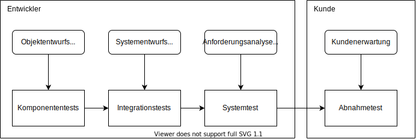

# Testen und Prüfen

## Fehlerklassen

Man kann generell Fehler in bestimmte Fehlerklassen aufteilen

### Anforderungsfehler (Defekt im Pflichtenheft)

Ein Anforderungsfehler ist ein Fehler (bzw. um genauer zu sein ein Defekt) der im Pflichtenheft ist.
Dies kann mehreres heißen:

- Inkorrekte Angabe der Wünsche des Kundens
- Unvollständige Angaben über funktionale Anforderungen, ...
- Inkonsistenz zwischen verschiedenen Anforderungen (die eine sagt X soll passieren und die andere sagt Y soll passieren, ...)
- Undurchführbarkeit

Generell kann ein Anforderungsfehler schwerwiegende Folgen mit sich bringen, wenn dieser bei einem relativ elementaren Teil
des Produktes auftritt und damit große Einflüsse hat und eventuell auch nicht leicht zu beheben ist.

### Entwurfsfehler (Defekt in der Spezifikation)

- Unvollständige oder fehlerhafte Umsetzung der Anforderungen
- Inkonsistenz der Spezifikation oder des Entwurfs
- Inkonsistenz zwischen Anforderungen, Spezifikation und Entwurf

### Implementierungsfehler (Defekt im Programm)

Hierbei gibt es nur die fehlerhafte Umsetzung der Spezifikation.

## Typen von Tests

Es gibt mehrere verschiedene Arten von Tests. Die meisten davon werden vom Entwickler durchgeführt, es gibt aber auch
welche die der Kunde macht: den *Abnahmetest*. Generell können Tests mithilfe von verschiedenen Dokumenten erstellt werden:

### Testhelfer

Testhelfer sind nützliche *Dinge* die einem beim Testen helfen sollen. Sie sorgen beispielsweise dafür, dass man die Existenz
von noch nicht implementierte Komponenten vortäuschen kann.

Hierbei unterscheidet man zwischen **Stummeln** (stub), **Attrappen** (dummy) und **Nachahmungen** (mock).
Die Unterschiede zwischen den 3 Typen können manchmal etwas verschmelzen, da alle eigentlich aufeinander aufbauen
und mehr funktionalität dem vorherigen hinzufügen.

Ein **Stummel** ist eine "Implementierung" der Schnittstelle einer Komponente die **absolut nichts tut**. Sie hat keine
Funktionalität, kein Methodenaufruf hat einen Effekt, es wird nichts sinnvolles zurückgegeben (meist einfach der "Standardwert"
für einen Datentypen, also vielleicht eine 0 für Integer, ...). Der Stummel dient zum größten Teil einfach dazu, dass das Programm
kompiliert werden kann trotz der fehlenden Komponente.

Wenn man dann ein wenig mehr Funktionalität einbaut ist man bei der **Attrappe** angelangt. Sie ist auch eine Implementierung
der Schnittstelle hat aber rudimentale Funktionalität. Sie kann vielleicht einen fest vereinbarten Wert bei jedem Aufruf
zurückgeben (jedes mal wird Benutzer "Max Mustermann" zurückgegeben) oder einen zufälligen (`#size()` gibt zufällig einen Wert
zwischen 0 und 36 zurück).

Zuletzt die **Nachahmung**. Die Nachahmung ist die mit den meisten Funktionen, sie kann Daten abspeichern wenn sie dies benötigt,
komplexere Rechnungen durchführen und man kann mit ihr fast wie mit der wirklichen Komponente testen. Als Beispiel könnte man
eine Schnittstelle für eine Benutzerdatenbank nehmen: Die Nachahmungen ist mit 3 Nutzern initialisiert und man kann alle Funktionen
wie Nutzer anlegen, Nutzer entfernen, ... aufrufen und der Zustand der Nachahmung ändert sich wirklich mit. Soetwas ist bei einer
Attrappe oder einem Stummel nicht möglich.

### Komponententests

> Unittests

Bei Komponententests macht man das, was der Name schon verrät. Man testet die einzelnen Komponenten auf ihre Funktionsweise.
Hierfür zieht man sich die Anforderungen an die Komponente herbei und testet, ob sie die richtigen Ergebnisse liefert und,
was auch sehr wichtig ist, wie sie sich mit fehlerhaften Daten verhält. Sie sollte in den besten Fällen dies erkennen und
korrekt behandeln, also passende fehler produzieren oder ähnliches. sie sollte vorallem nicht super irreguläres Verhalten
zeigen.

### Integrationstest

Vorraussetzung: Jede involvierte Komponente wurde bereits für sich überprüft

Das Zusammenspiel der einzelnen Komponenten wird beim Integrationstest überprüft, nicht die einzelnen Komponenten selbst. Dies ist schon zuvor bei den Unittests passiert.

Man kann hierbei einen iterativen Ansatz benutzen:

Zunächst hat man nur eine kleine Menge an Komponenten schon komplett implementiert und getestet, somit erstellt man sich für die vielen fehlenden erstmal Attrappen und Stummel.
Mit Hilfe dieser schreibt man dann erste Integrationstests in denen man dann das Zusammenspiel der schon implementierten Komponenten testet und vielleicht schon einige Interaktionen
mit den Attrappen. Im Laufe der Entwicklung werden dann immer mehr Attrappen durch wirkliche Implementierungen getauscht und es gibt viel mehr Interaktionen die getestet werden können.
Am Ende sollte man dann bei einem vollkommen implementierten System landen und für die Interaktionen zwischen Komponenten Integrationstests geschrieben haben.

Es gibt verschiedene Anzätze wie man dies strukturiert bzw. zeitlich priorisiert:

- **Big Bang**: es werden erst **alle** Implementationen gemacht und danach erst die Tests geschrieben (keine gute Idee)
- **Top-Down**: Die am höchsten liegenden Komponenten werden zuerst gebaut, somit braucht man also für die darunterliegenden Attrappen / Stummel,
  und man arbeitet sich Schritt für Schritt nach unten runter. Vorteil ist hierbei, dass man dem Kunden das "finale Produkt" sozusagen schonmal
  zeigen kann obwohl nur die oberste Schicht fertig ist, aber diese ist ja genau die Schicht, die der Kunde die meiste Zeit sehen wird.
  Ein Nachteil ist, dass man gerne mal aufwendige Attrappen / Stummel schreiben muss, welche sobalb die richtige Implementation da ist nicht mehr
  viel Nutzen haben werden.
- **Bottom Up**: Die "unten liegenden" Komponenten werden zuerst gebaut und getestet und man arbeitet sich Schritt für Schritt nach oben hoch.
  Vor- und Nachteile sind genau gegensätzlich zu Top-Down.
- **Outside-in**: Eine Kombination aus Top-Down und Bottom-Up, welche von beiden Seiten nach innen arbeitet. (Nicht richtig genutzt)
- **Inside-out**: Das Gegenstück zu Outside-in: Arbeitet sich von der Mitte nach außen. (Auch nicht richtig genutzt)
- **Hardest-First**: Anstatt sich auf eine "Richtung" zu einigen in die man arbeitet implementiert man einfach zunächst die schwersten und
  komplexesten Komponenten und testet sie. Ein großer Nachteil kann hierbei sein, dass diese Komponenten nichts miteinander zu tun haben
  können und man somit für vieles Attrappen bauen muss.

### Systemtest

Der Systemtest prüft das inziwschen komplett implementierte System (Komplettsystem) gegen seine Spezifikation.
Hierbei achtet man nichtmehr richtig darauf in welche Komponenten das System geteilt ist, sondern testet das große ganze.
Man sieht es also eine Art blackbox an und versucht aufzudecken, wo das Programm von seiner Spezifikation abweicht. Gerne
verwendet man hierfür eine so realitätsgeträue Umgebung wie nur möglich, also z.B. ein komplettes Replika der Produktionsumgebung.

Man teilt grundsätzlich den Systemtest in 2 Teile auf: der eine Teil testet die funktionalen Anforderungen, während der andere die
nicht-funktionalen Anforderungen überprüft. Bei dem nicht-funktionalen Systemtest wird z.B. auf:

- Sicherheit
- Benutzbarkeit
- Interoperabilität
- Dokumentation
- Ausfallsicherheit
- und zu guter letzt die Leistung

geachtet.

### Regressionstest

Wenn man einen bereits bestandenen Test zu einem späteren Zeitpunkt nocheinmal ausführt um zu überprüfen, ob sich in der Zwischenzeit nichts
zum schlechteren verändert hat nennt man Regressionstest.

### Abnahmetest

Der Abnahmetest ist dem Systemtest sehr ähnlich. Hierbei gibt es nur die Unterscheidung, dass der Abnahmetest nichtmehr im eigenen Haus durchgeführt wird,
sondern beim Kunden vorort. Mit dem Abnahmetest verifiziert sich der Kunde ein letztes Mal vor der Abnahme, dass wirklich alles korrekt ist. Idealerweise
werden hierbei wirkliche Daten verwendet und die Umgebung ist schon genau die gleiche wie die in der die Software finalerweise laufen wird. Der Kunde kann
sich natürlich auch eigene Tests überlegen, welche er dem System unterstellen will. Zum Abnahmetest gehören idealerweise auch Stress- und Belastungstests.

Die formale Abnahme durch den Kunden beendet, sobald alle Fehler die noch gefunden wurden behoben sind, die Entwicklung an der Software. Danach geht es dann
in die Wartungs und Pflege Phase des Softwareproduktes über.

## Testfallbestimmung

Am liebsten würde man alles testen, dies ist aber **sehr sehr sehr** schnell nichtmehr möglich, also muss man sich auf eine sinnvolle Menge an Tests
beschränken. Um diese sinnvolle Menge zu finden (oder zu generieren) gibt es verschiedene Methoden.

Man kann die Eingaben zunächst mal in Äquivalenzklassen einsortieren, abhängig von der Funktionalität die die Komponente gerade implementiert.

Hierfür nimmt man sich die Anforderungen an die Komponente her und schaut welche Eingaben welches Ergebnis hervorrufen sollen und gruppiert danach
die Eingaben (bspw. soll eine Komponente für Werte von 0-50 ein Verhalten haben und für Werte von 51-100 etwas anderes Verhalten). Danach kann man
sich dann einige Elemente aus der Äquivalenzklasse nehmen und damit testen oder wirklich für diese Elemente alles wie gefordert funktioniert.
Man hat damit dann die Menge an zu testenden Eingaben sehr stark minimiert. Dies nennt man **funktionale Äquivalenzklassenbildung**.

Eine Methode die auf der funktionalen Äquivalenzklassenbildung aufbaut ist die **Grenzwertanalyse**. Hierbei sucht man die "Grenzen" zwischen den
Äquivalenzklassen (bspw. die 50, 51 im obigen Beispiel) und kontrolliert (zusätzlich) diese Grenzen auf ihre Eigenschaften. Hiermit kann man dann
im besten Fall "off-by-one"-Fehler oder ähnliches finden.

Einfach zufällige Eingaben generieren und gucken ob das Programm irgendwann abstürzt oder ähnliches ist auch eine Methode des Testens
(**Zufallstest** bzw. *Fuzzing*). Was bei Zufallstests schwierig ist, ist zu überprüfen ob das Ergebnis was man zurückkriegt korrekt ist,
da man ja nicht für jede mögliche Eingabe das Ergebnis kennen kann. Manchmal werden daher Zufallstests eher dazu verwendet zu gucken ob ein Programm
abstürzt, wenn man dies mit zufälligen Eingaben füttert. Manchmal lässt sich auch ein Ergebnis leichter verifizieren als es auszurechnen ist (bspw.
Primfaktorzerlegung, Matrix Inverse berechen, Verschlüsselung), in diesen Fällen können dann Zufallstests gut funktionieren.
