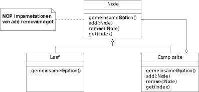
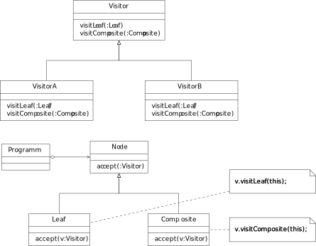
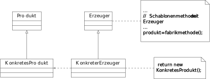
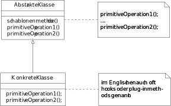
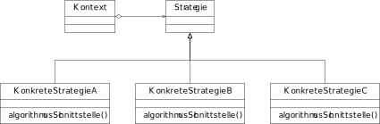

# Variantenmuster

## Abstrakte Fabrik

## Kompositum



## Besucher



## Erbauer

## Fabrikmethode



## Schablonenmethode

Die Idee hinter der Schablonenmethode ist etwa gleich der hinter Generics. Man hat einen bestimmten Algorithmus,
welcher mit vielen verschiedenen Typen klar kommen könnte, aber man muss da es andere Typen sind für alles einen
neuen Algorithmus schreiben. Bei diesem ändert sich aber eigentlich nie richtig viel, die zentrale Idee ist immer
die gleiche. Das einzige was an einigen Stellen etwas voneinander abweicht ist der Zugriff auf Daten an einigen Stellen
oder die Berechnung eines Wertes.

Die Idee hinter der Schablonenmethode ist es nun einfach diese Sachen jeweils in eine eigene Methode zu extrahieren und dann
den danach gleichen Code in den Klassen einfach zu extrahieren. Dazu erstellt man eine abstrakte Klasse, welche den
zuvor duplizierten Code als implementierte Methode hat und alles was extrahiert wurde in eigene Methoden als abstrakt
deklariert.

Dadurch kann man nun einfach beliebige Unterklassen für bestimmte Typen erstellen und muss nicht jedes mal den kompletten
Algorithmus kopieren und anpassen, sondern nur immer die kleinen Methoden, die zwischen Typen variieren.

Diese Methoden nennt man auch primitive Operationen oder Einschubmethoden.



Dieses Muster kann man gut vergleichen mit Halbordnungen und Relationen aus GBI. Man braucht eine *Methode* Objekte einer Art zu vergleichen,
wie das konkret aussieht ist abhängig vom Typen, aber man kann trotzdem Aussagen machen mit diesen Relationen, obwohl man
die genaue *Implementierung* nicht unbedingt kennt (Symmetrisch, Transitiv, ...).

Ähnlichkeiten zu dem Schablonenmethodenmuster kann man auch in der Gruppentheorie finden.

## Strategie

Die Strategie kann gut genutzt werden, wenn man mehrere Algorithmen, Datenstrukturen oder ähnliches hat die das gleiche tun aber
in bestimmten Bedingungen oder Situationen einer dem anderen Vorgezogen werden soll (z.B. abgängig von der Platform oder
größe der Eingaben).



Hierbei nutzt man eine abstrakte Klasse oder Schnittstelle, welche den Algorithmus oder ähnliches repräsentiert und
alle Methoden als vorgibt, die die Algorithmen/... bereitstellen sollen. Dazu gibt es eine Methode, welche die am
besten passende Unterklasse wählt. Diese kann sich als implementierte Methode in der abstrakten Klasse befinden oder
auch an anderen Stellen.

```java
switch(<Bedingung>) {
  case <Fall1>: return new KonkreteStrategieA();
  case <Fall2>: return new KonkreteStrategieB();
  case <Fall3>: return new KonkreteStrategieC();
  default:      return null;
}
```

Die Strategie kann helfen, wenn man ein Programm hat, welches sehr viele Switch-Statements hat, die immer alle die
gleichen Fälle haben. In diesem Fall kann es oft sein, dass man die einzelnen Fälle einfach in eigene Klassen aufteilen
kann und dann ein einziges Switch-Statement hat, welches entscheidet welche dieser Klassen genommen wird. Die einzelnen
Klassen haben dann natürlich keine Switch-Statements mehr, da in jedem Fall anhand der Klasse klar ist welcher Fall
eintreten wird.

## Dekorierer

